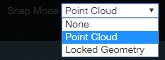

# Snap Mode

## None:

All the movements will be fixed on the XY plane in the current view. You are not able to change the Z axial, unless you rotate the point cloud and change the view point

## Point Cloud:

The selected vertex will be dropped onto the nearest point on the point cloud and you are not allowed to put a vertex in the black area without any points.

## Locked Geometry:

This mode is only active when a plane is locked and it will be turned on automatically when you lock a plane. All movements are going be fixed on the locked plane or the coplanar to the locked plane.

