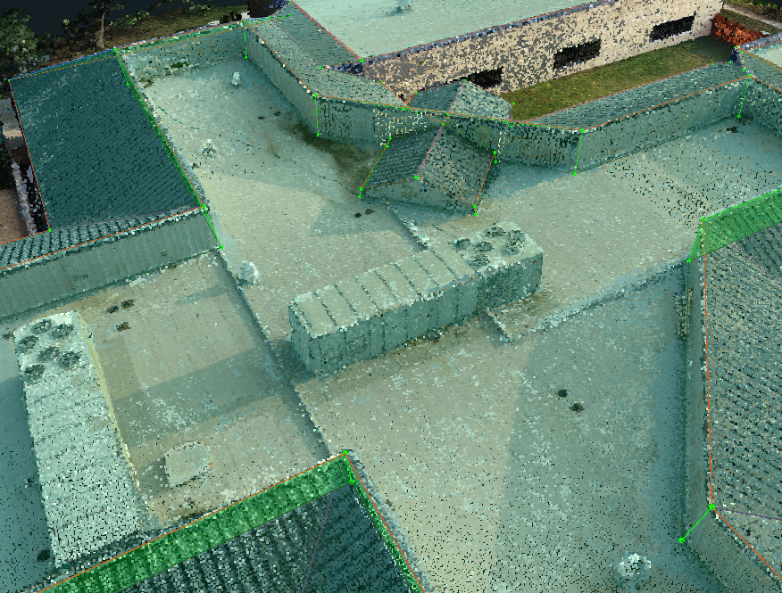
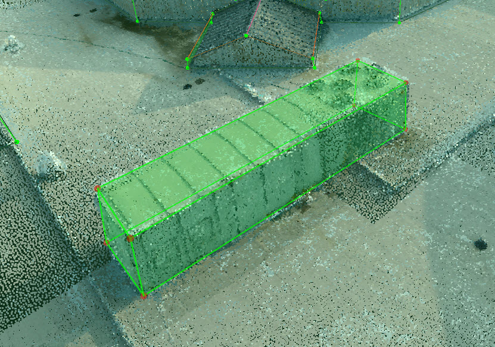
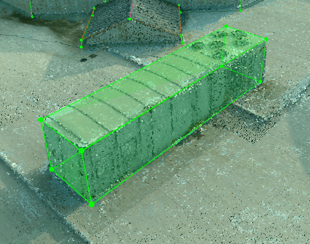
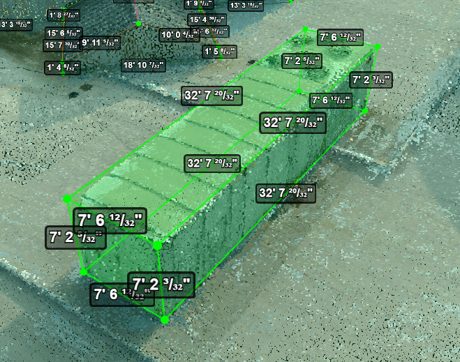

# 3D Penetration

This page is going to give you the instruction how to get the width/length/height of a 3D penetration, like a AC unit or curb.

Outline the structure roughly by new vertices.

Adjust each vertex in 2D

Align each edge individually to make it a cuboid  

