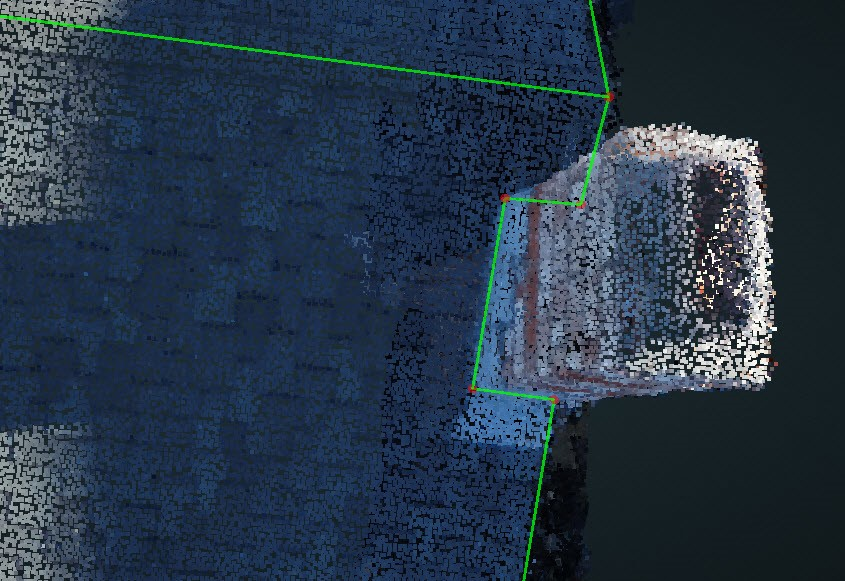

# Special Cases

## Camera:

You should be able to view all the camera location by clicking the camera icon besides each image.

All the camera locations will be viewable above the 3D model in the Camera layer and if you select the red camera, the relative camera view will be updated in the 2D view.

## Overhang:

> Typically, it is hard to find the image with the vertex under the overhang, but it might be easier to change the vertex in the 3D view.

1. Find three vertices on that plane and press `Space` to Lock the plane. If there are less than 3 vertices, [Create](../basic-function/#create) more.

   

2. Under [Modify](../basic-function/#modify), Drag the vertex in the 3D view. Since the plane has been locked, so all the movements are only allowed in that plane.
3. Turn on the [Adjust Vertices](../advanced-function/#adjust-vertices) panel to see the 2D view of the vertices to help you find the exact location of the vertices.

## Trees:

> Tree shadow will destroy a part of the point cloud, usually, it will be a corner.

1. [Create](../basic-function/#create) the two uncompleted edges near the corner.

   

2. Use [Intersect Lines](../advanced-function/#intersect-lines) to intersect the two edges to generate the corner point.
3. Turn on the Edge Dimensions layer to double check the corner location.

## Chimney:

> Chimneys are on the edge of the roof. It is not hard to draw, but if you want to make the GeoJSON looks better, [Align](../basic-function/#align) function is very useful, just align the flashing of the chimney with the nearby edges.

## Penetration:

> Penetrations are needed for Tesla projects, and you will see "label obstructions" in the description field of the projects.

1. Finish the entire roof first and get ready for the penetrations.
2. Start from one of the planes, open the 2D images first to count the total numbers of the penetrations to make sure you won't miss any penetrations in this plane. Lock this plane, go to [Vertex Mode](../mode/#vertex-mode) and draw a small square which covers the penetration.

   

3. Change to [Surface Mode](../mode/#surface-mode) and hold `Ctrl` to multi-select all the squares in this plane and [Attach](../tools/#attach) all the penetrations onto the parent plane. You will see the penetrations turn to blue and all the operations related to the penetrations are fixed in the plane now.

   

4. Then same as how to deal with the [Overhang](./#overhang). Lock the plane first, then you could either open the [Adjust Vertices](../advanced-function/#adjust-vertices) and adjust every corner one by one, or drag the vertex in the 3D view and check the vertices location in the 2D view at the same time, until all the vertices in this plane are adjusted.
5. Turn on the Edge Dimensions layer and [Align](../basic-function/#align) the relative edges to make sure the penetration is either a square or rectangle.
6. Open the [Adjust Vertices](../advanced-function/#adjust-vertices) and check every plane one by one in the 2D images to make sure there is not any missing penetrations.\(Any obstruction which will affect the setup of solar panel should be treated as penetration\)
7. [Detect Edge Types](../tools/#detect-edge-types) and you will see all the penetrations will turn to Step Flashing if they are attached correctly.

   

8. If the roof plane is changed or deleted, you may need to redo the penetrations since it is going to be detached or moved with the plane.

## Flat Roof:

> Typically, it is hard to select the corner of the flat roof because of the texture and the parapet.

1. Outline the flat roof as close as the actual corner, do not need to perfect it on the corner but need to make sure the plane is correct.

   

2. [Select](../basic-function/#select) and lock the flat plane and then open [Adjust Vertices](../advanced-function/#adjust-vertices) to change Triangulation to 1 Image + Locked Plane.
3. Scroll all the viewable images to find the best one and only use that image to adjust the vertex into the correct location.
4. Repeat Step 3 to adjust every vertices.

## Dormers:

1. First, finish the dormer as normal and there is no need to draw the outline of the shadow in the lower plane.

   

2. Lock the plane and adjust the top three vertices of each dormer.
3. After you save and generate the resources, the QA tool is going to take the dormers as cutouts automatically and you need to double check it in the GeoJSON.

   

