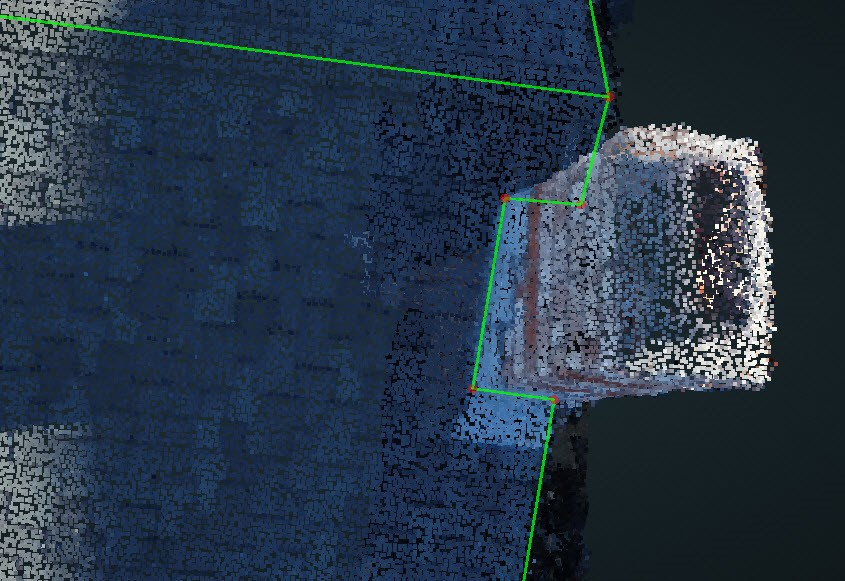

## Chimney:

> Chimneys are on the edge of the roof. It is not hard to draw, but if you want to make the GeoJSON looks better, [Align](../basic-function/#align) function is very useful, just align the flashing of the chimney with the nearby edges.

