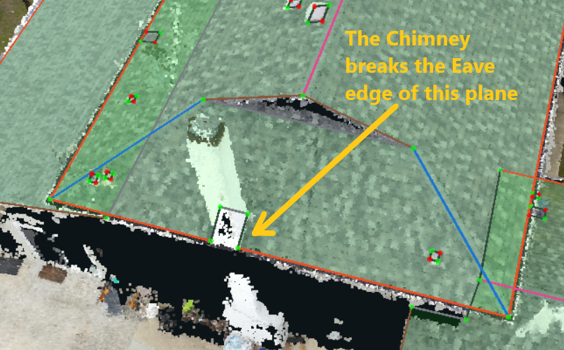
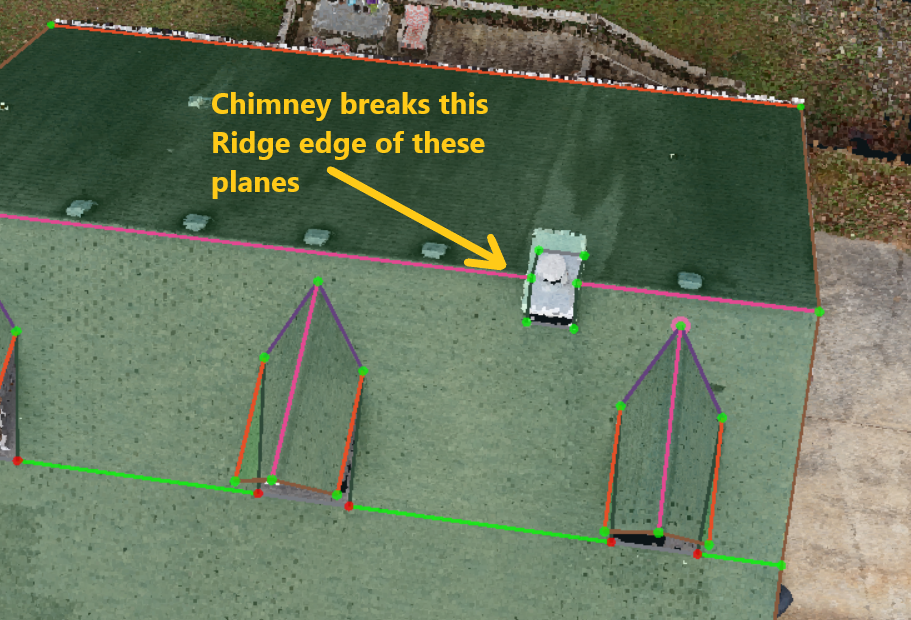
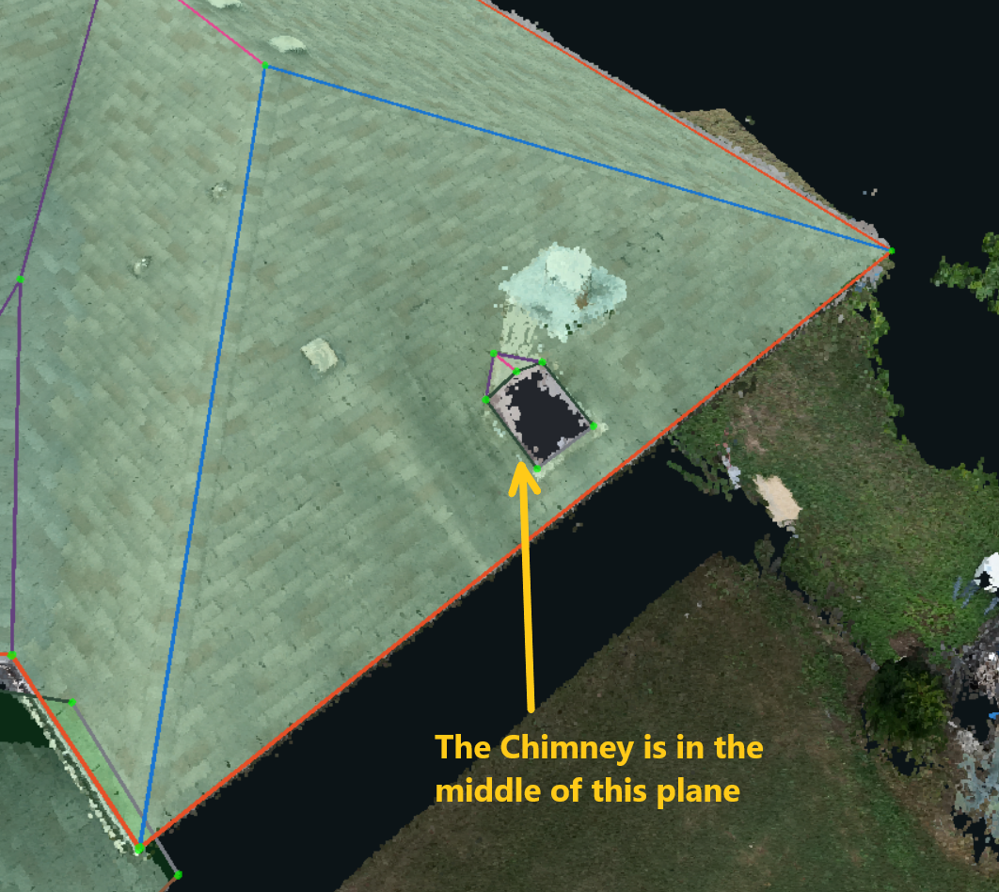

# Chimneys

| Customer | Include if Chimney breaks an Edge | Include if Chimney is in the middle of a Plane |
| :--- | :--- | :--- |
| Kespry | Yes | No |
| DroneDeploy \(all types\) | Yes | Yes |
| BetterView | Yes | No |
| Airbus Aerial | Yes | No |
| FairFleet | Yes | No |
| KittyHawk | Yes | No |

* The first 2 images below are examples of a Chimney breaking an Edge -- all customers require this type of chimney to be wireframed:

* The image below is an example of a Chimney in the middle of a Plane:

