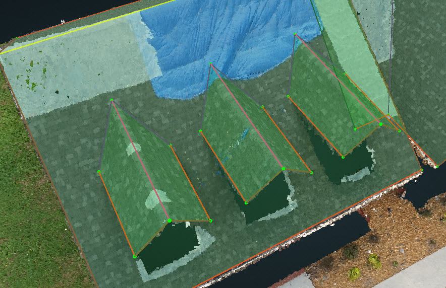
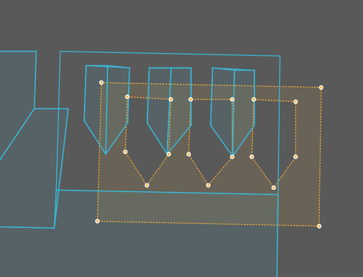

# Dormer

1. First, finish the dormer as normal and there is no need to draw the outline of the shadow in the lower plane.

   

2. Lock the plane and adjust the top three vertices of each dormer.
3. After you save and generate the resources, the QA tool is going to take the dormers as cutouts automatically and you need to double check it in the GeoJSON.

