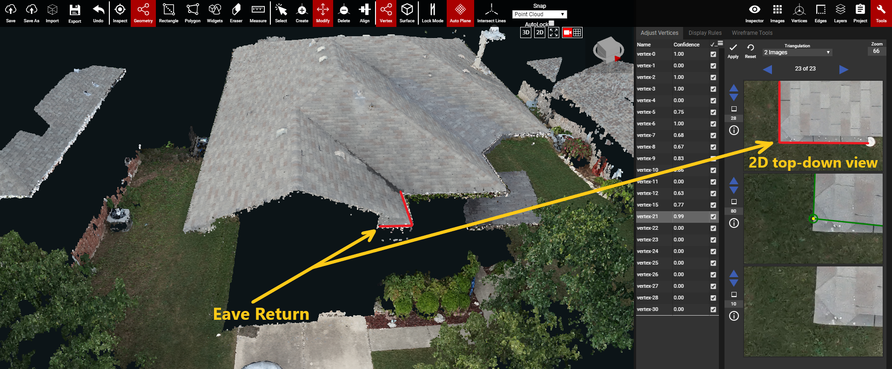

# Eave Returns

An Eave Return occurs when the Eave edge of a plane extends out past its Rake edge, and then curves around in front of the Rake. The small portion of roof in front of the rake is the Eave Return \(shown in the first image below\). These are usually very poorly reconstructed in the point cloud. There is a special way these can be wireframed so users don't spend too much time on this small feature.

Instead of trying to wireframe the Eave Return, users can pull the end vertex of the rake edge straight down to where it would normally meet the eave edge. This ignores the extra Eave Return geometry completely. \(shown in the image below\)

