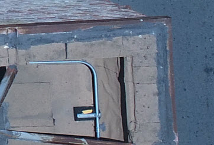
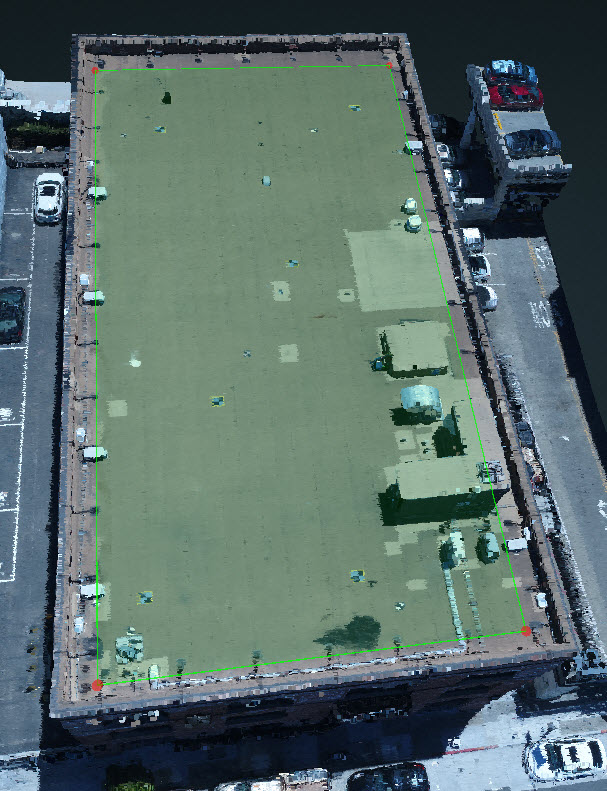

# Flat Roofs

Typically, it is hard to select the exact corner of the flat roof due to the texture of the roof and the occlusion caused by the parapet wall.

1. Outline the flat roof as close to the actual corner as possible. It does not need to be exactly on the corner, but the plane does need to be correctly aligned.

   

2. Lock the flat plane and open [Adjust Vertices](../tools/adjust-vertices/) to change the Triangulation setting to 1 Image + Locked Plane.
3. Scroll through all of the available 2D images to find the best one and only use that image to adjust the vertex to the correct location.
4. Repeat Step 3 to adjust every vertex on the plane.


[2D Mode](../preset-and-projection-view.md) is a great way to see the roof from the top-down view. Users are able to check if the wireframe is going off/through the point cloud where it shouldn't be. They can quickly adjust the rough wireframe by locking the plane.



If the commercial flat roof requires penetrations, please refer to the [Penetrations](../penetration.md) section for tips and tricks on locating all of them.


