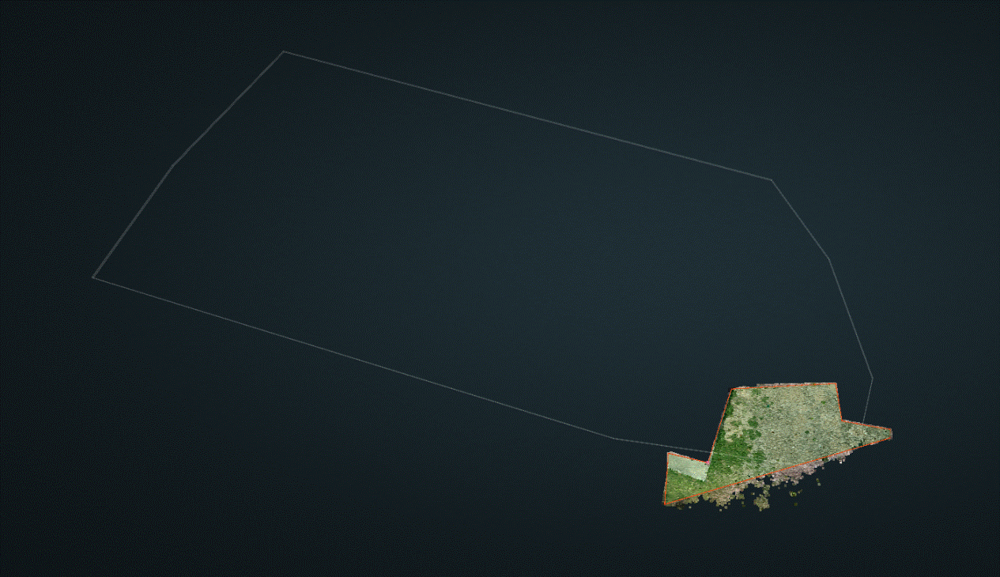
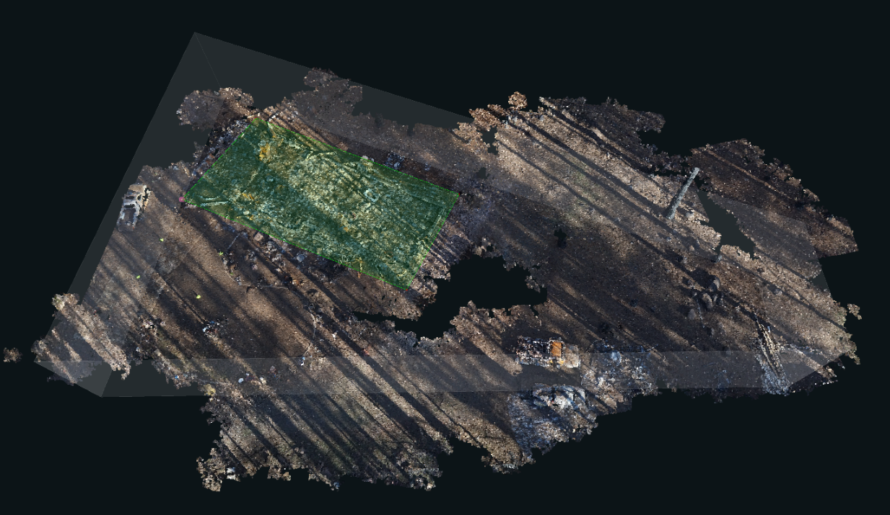
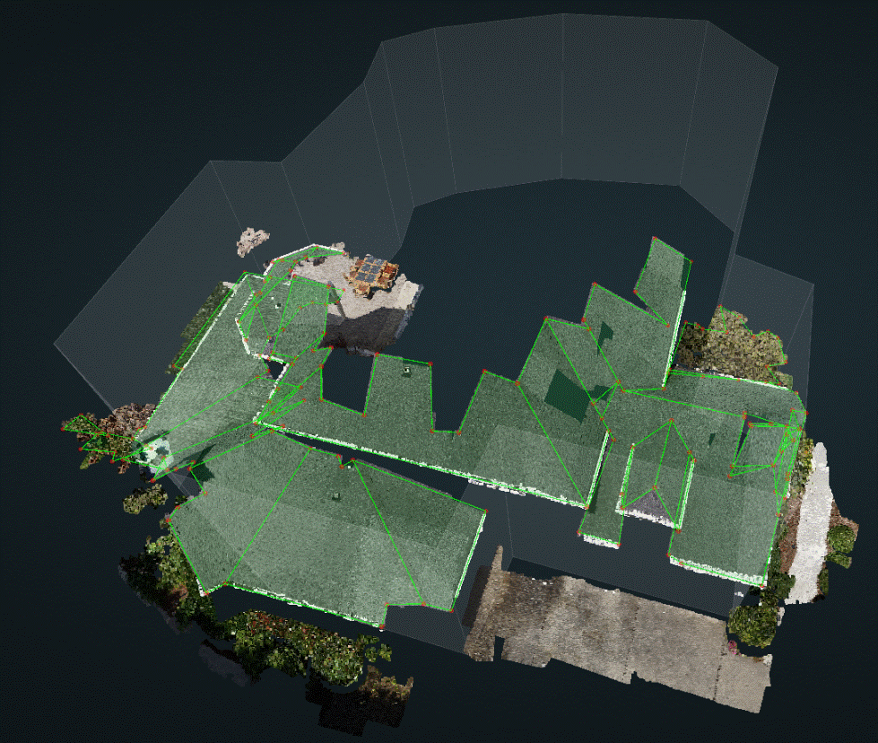
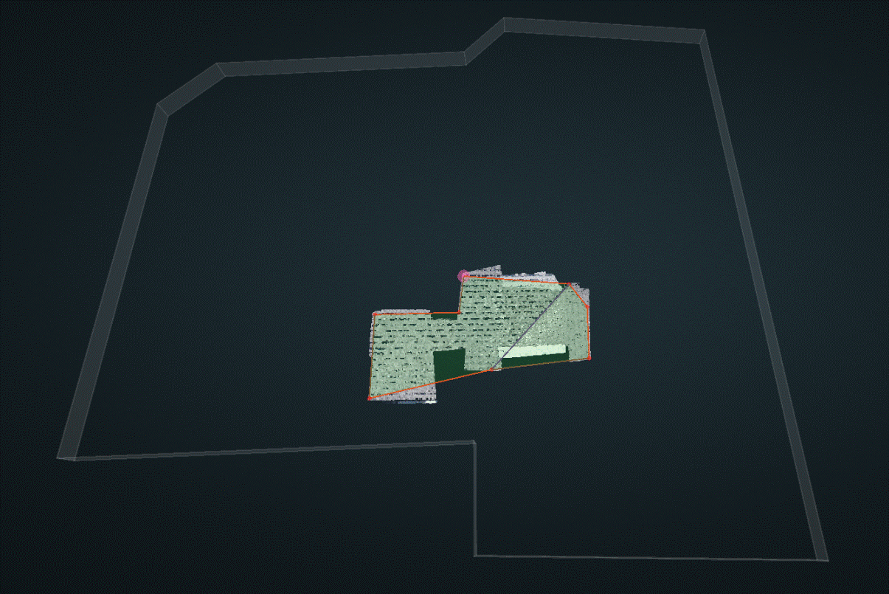
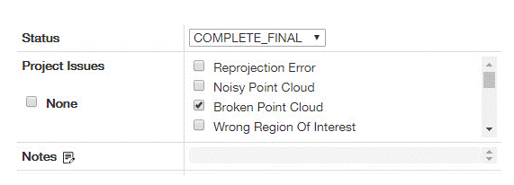
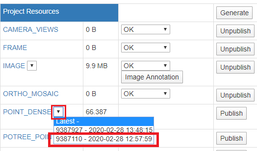
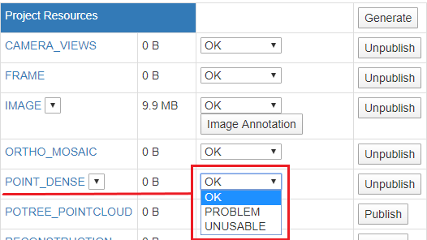

# How to Deal with a Broken Point Cloud


This page is under construction


Kespry is doing testing flights on site by the pilot sometimes, and they are not expecting any results from this kind of testing projects. There is no need to put these broken point cloud to `IN_REVIEW` or `IN_SUPPORT`, since they could be done easily.

**Case 1:** Ground/Dirt/Grass/Rubble without any structures.

**Example:** `12243, 21658`

**Solution:** Typically, the autogen is empty since no structures are detected. So please draw a rectangle on the ground and publish. If there are outlier vertices on trees or neighboring structures, then delete all of those and then draw the rectangle on the ground. There is no need to worry about the edge types since they do not make any sense.

**Case 2:** Most of the roofing is not captured.

**Example:** `12198, 11872`

**Solution:** Typically, there will be an autogen branch although the autogen wireframe is a little broken or messy. What you need to do is to save the autogen into qa branch and publish the wireframe which generated automatically. Again, there is no need to worry about the edge types since they do not make any sense.

**Case 3:** Part of the roofing is not captured.

**Example:** `11808`

**Solution:** Take it as a regular project, but ignore the uncompleted planes. Do not waste your time on the corners which are not shown on any cameras.


Always remember to check the _**Broken Point Cloud**_ before you publish the project.


For **Case 1 and Case 2** where there are not any completed planes, change the `POINT_DENSE` to `UNUSABLE`.

For **Case 3** where there are several completed planes, change the `POINT_DENSE` to `PROBLEM`.

In order to get the dropdown menu to set the point\_dense to Problem or Unusable, the original POINT\_DENSE file must be selected

* Click on the dropdown arrow to the right of POINT\_DENSE, and select the oldest point\_dense file -- outlined in red in the image below:

* Once the oldest file is selected, the dropdown menu for setting the Point\_Dense to Problem or Unusable will become available and can be set to the desired issue -- as shown below:


For projects with Unusable POINT\_DENSE, do not waste time assigning/detecting edge types.



For projects with Problem POINT\_DENSE, extend the edges as far as you can see in the 2D images. Assign the edge types based on the images, but Do Not spend too much time on this. The point cloud is still broken, and bad quality, and should not yield accurate results.


