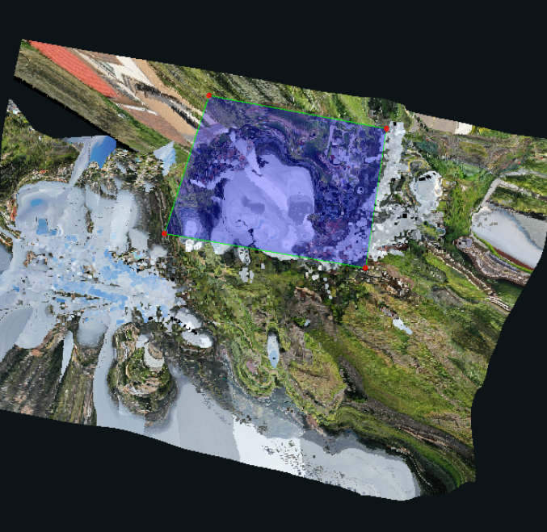

# How to Deal with a Broken Point Cloud

Sometimes Kespry will have their pilots run test flights. They are not expecting meaningful results from these type of projects. There is no need to set these to `IN_REVIEW` or `IN_SUPPORT`, since they can be completed easily. The structure type should reflect what is shown in the cloud: If there is no structure, then set it to None. If the structure is broken, but you can still tell what type of structure it is, then set it to Singlefamily/Multifamily/Commercial. If there is roof showing, but you can't tell what type of structure it is, then set it to Unknown.

**Case 1:** Ground/Dirt/Grass/Rubble without any structures.

**Example:** `12243, 21658, 147800`

**Solution:** Typically, the autogen will be empty, since no structures are detected. All you need to do is draw a rectangle around the property or chunk of cloud. If there are outlier vertices on trees, or neighboring structures, then delete those and draw a rectangle on the ground. There is no need to worry about the edge types or verifying the vertices since they do not make any sense. Structure type should be set to None or Unknown. Generate the resources, set the point dense to unusable, set project issues to broken point cloud, and publish. 

**Case 2:** Most of the roofing is not captured.

**Example:** `12198, 11872, 58972`

**Solution:** Typically, there will be an autogen branch, although the autogen wireframe might be broken or messy. Save the autogen wireframe to the qa branch and publish that. If there isn't an autogen wireframe, then put a rough wireframe around the structure. Again, there is no need to verify vertices or worry about the edge types since they do not make any sense. Structure type should be set to Singlefamily/Multifamily/Commercial if clear, and Unknown if the structure is unclear \(like image 2\).

**Case 3:** Part of the roofing is not captured, and causes large broken areas in the point cloud.

**Example:** `140843`

**Solution:** Take it as a regular project, but ignore the incomplete/broken portions. Detect edge types, and verify vertices, like normal. However, do not waste your time verifying the vertices where the point cloud is broken. Instead, put a rough wireframe on it and then ignore during verification. Structure type should be set to Singlefamily/Multifamily/Commercial.


Always remember to check the _**Broken Point Cloud**_ before you publish the project.


For **Case 1 and Case 2** where there are not any completed planes, change the `POINT_DENSE` to `UNUSABLE`.

For **Case 3** where there are portions of broken and completed planes, change the `POINT_DENSE` to `PROBLEM`.


For projects with Unusable POINT\_DENSE, do not waste time assigning/detecting edge types.



For projects with Problem POINT\_DENSE, extend the edges as far as you can see in the 2D images. Assign the edge types based on the images, but Do Not spend too much time on this. The point cloud is still broken, and bad quality, and should not yield accurate results.


