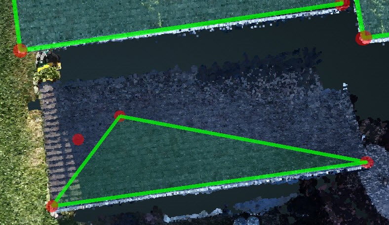

# Overhang

> Typically, it is hard to find the 2D image with the vertex under the overhang, but it might be easier to change the vertex in the 3D view.

1. Find three vertices on that plane and press `Space` to Lock the plane. If there are less than 3 vertices, [Create](../basic-function/#create) more.

1. Under [Modify](../basic-function/#modify), Drag the vertex in the 3D view. Since the plane has been locked, all of the movements are only allowed in the direction of that plane.
2. Turn on the [Adjust Vertices](../advanced-function/#adjust-vertices) panel to see the 2D view of the vertices to help you find the exact location of the vertices.

