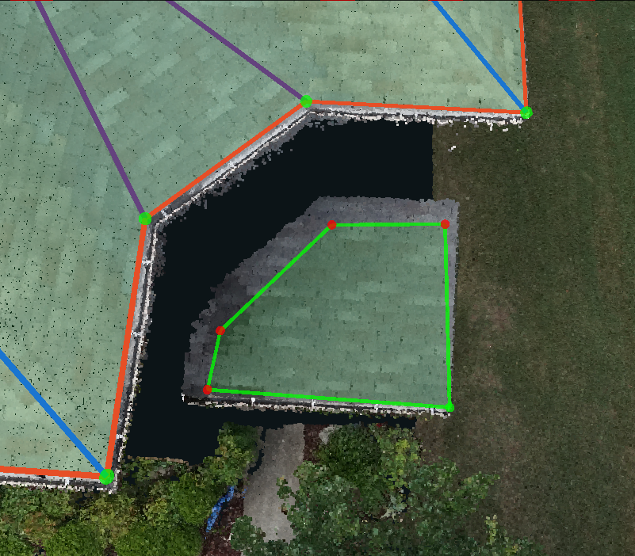
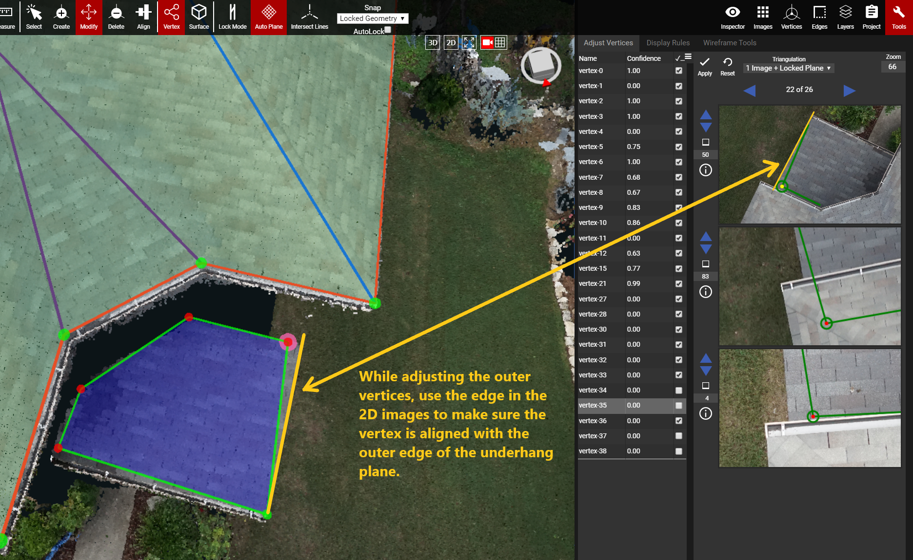
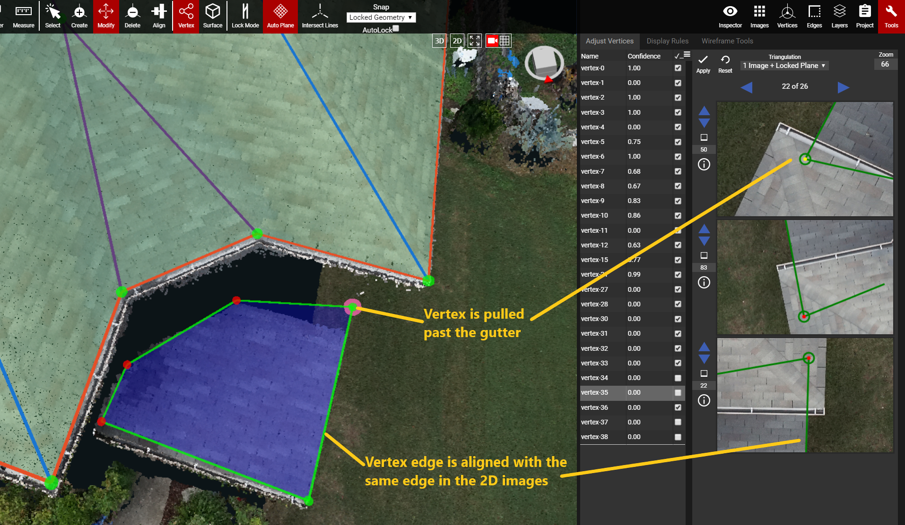
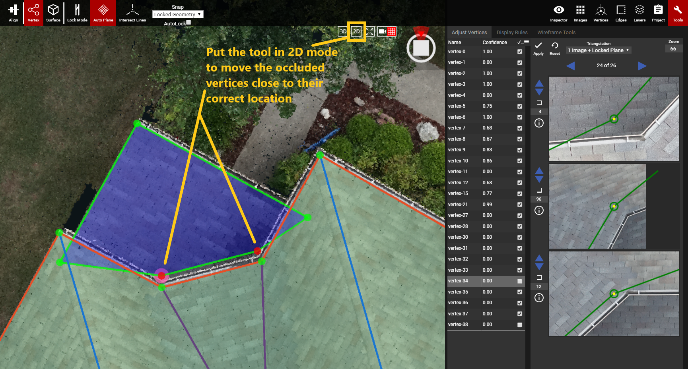
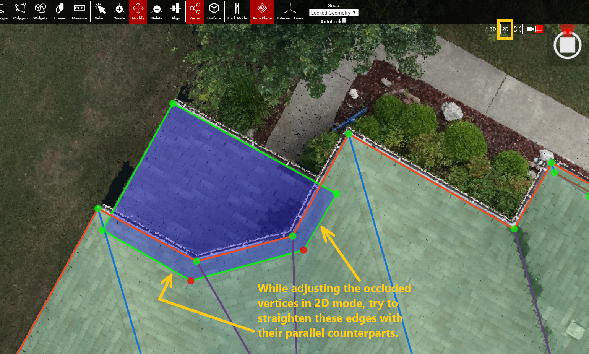

# Underhangs

Typically, it's hard to find a 2D image that shows the occluded vertices of an underhang roof. It is sometimes easier to adjust the vertices with a combination of the 3D window and 2D images. The 3D window can also be put into [2D mode](../preset-and-projection-view.md) and the occluded vertices can be adjusted that way \(the steps and images below show an example of this process\).

If it is hard to rough out the underhang, due to a noisy and/or broken point cloud, then set the [Snap Mode](../advanced-function/snap-mode.md) to None and rough out the plane. Use the [Align](../3d-scene-manipulation-tools/geometry/align.md) function to align the horizontal parallel edges, of the underhang, to an accurate Eave or Ridge edge that is parallel to ground and the underhang edges as well. Afterward, a combination of the 2D images and the 3D window put into 2D mode can be used to fully adjust the underhang.

* Make a rough plane on the underhang, and adjust/verify the vertices that are visible in the 2D images and not hidden by the overhang. Make sure to lock the plane when doing these adjustments.

* While in [Modify](../3d-scene-manipulation-tools/geometry/modify.md), with the plane locked, drag the vertices to their approximate location. Since the plane is locked, all of the movements will stay locked on the angle/direction of that plane.

* Turn on the [Adjust Vertices](../tools/adjust-vertices/) panel to see the 2D images of the vertices that are on the outer edges of the underhang plane. The 2D images will show the edges of the underhang plane. Even though the end location of the vertex is hidden, the images can still be used to adjust the vertex so that it's edge aligns with the edge in the 2D images.
  * Pull the vertex far enough that it goes past the gutter above it \(second image below\).

* To help adjust the occluded vertices of the underhang, put the tool into 2D mode. With the underhang plane locked, use the 2D images and the 2D view of the tool to adjust/verify those vertices.

* While pulling the occluded vertices in the tool, in 2D mode, try to align the occluded edges with their parallel counterparts. **DO NOT** use the [Align](../3d-scene-manipulation-tools/geometry/align.md) tool at this stage, because it will mess up the other verified underhang vertices. Click on one of the unverified, occluded, vertices and hit Apply in the Adjust Vertices panel, to verify the vertex.
* Make sure that the underhang looks good in 2D mode
  * There should be no gaps/spaces between the overlapping edges of the underhang and overhang.
    * Making sure the occluded vertices are pulled past the gutter of the overhang will guarantee no gaps.
  * The occluded section of the underhang should follow the edges of the overhang. Imagine that there is a wall coming straight down from the overhang to the underhang. The occluded edges/vertices should go around that invisible wall from the overhang \(like the example in the image below\).

