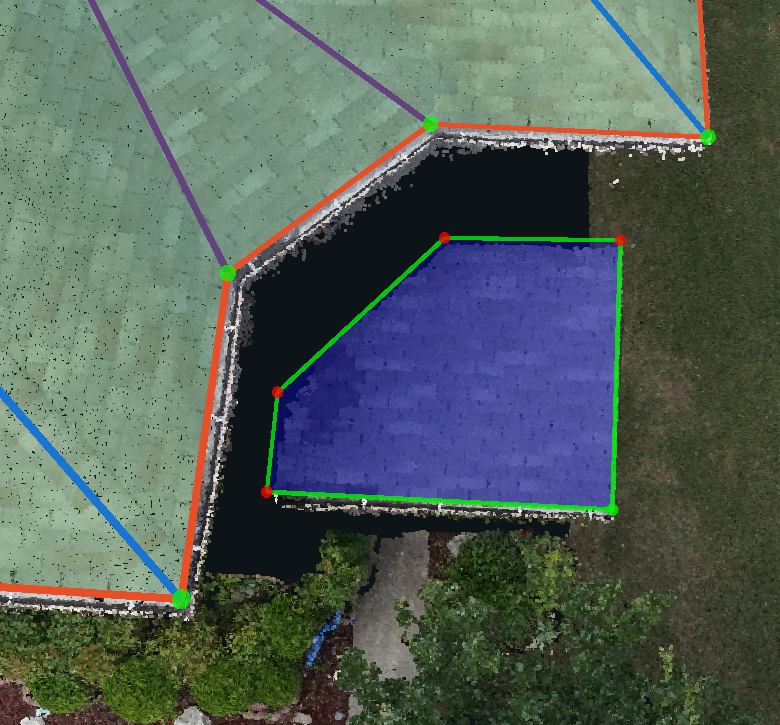

# Underhangs

> Typically, it is hard to find a 2D image that shows the underhang's vertices that are hidden by the overhang, and it might be easier to change the vertex location in the 3D window instead.

* Make a rough plane on the underhang, and adjust/verify the vertices that are visible in the 2D images and not hidden by the overhang. Make sure to lock the plane when doing these adjustments.

* While in [Modify](../3d-scene-manipulation-tools/geometry/modify.md), with the plane locked, drag the vertices to their approximate location. Since the plane is locked, all of the movements will stay locked on the angle/direction of that plane.

* Turn on the [Adjust Vertices](../tools/adjust-vertices/) panel to see the 2D images of the vertices that are on the outer edges of the underhang plane. The 2D images will show the edges of the underhang plane. Even though the end location of the vertex is hidden, the images can still be used to adjust the vertex so that it's edge aligns with the edge in the 2D images.
  * Pull the vertex far enough that it goes past the gutter above it.

