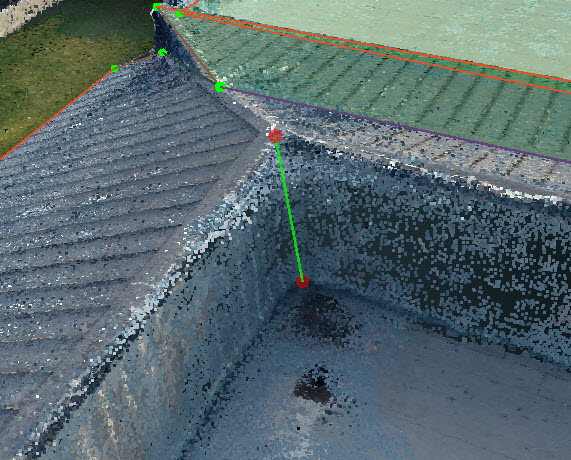
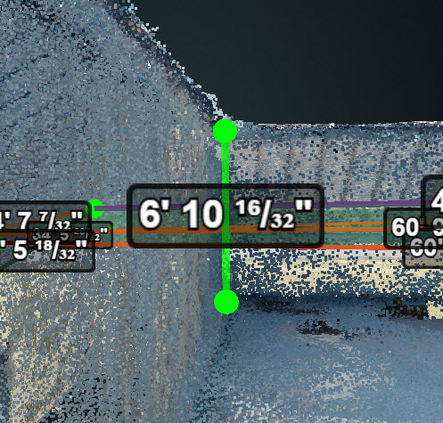

# Parapet Walls

Introduction about how to get the height of the parapet walls.

Created two corner vertices and connect them together.

Adjust the two corners in 2D images and turn on the edge dimension.

  

