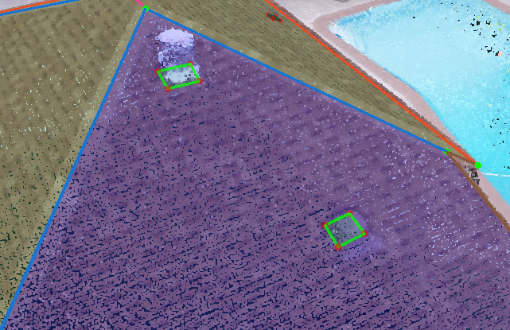
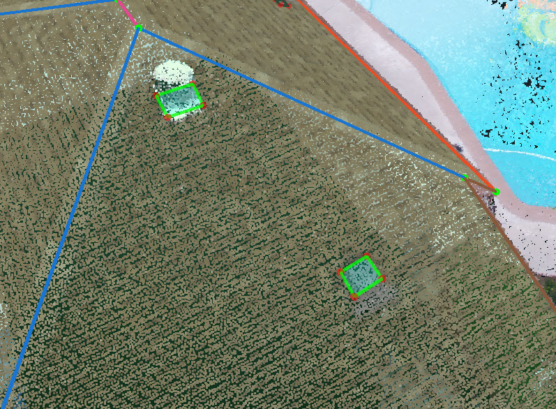
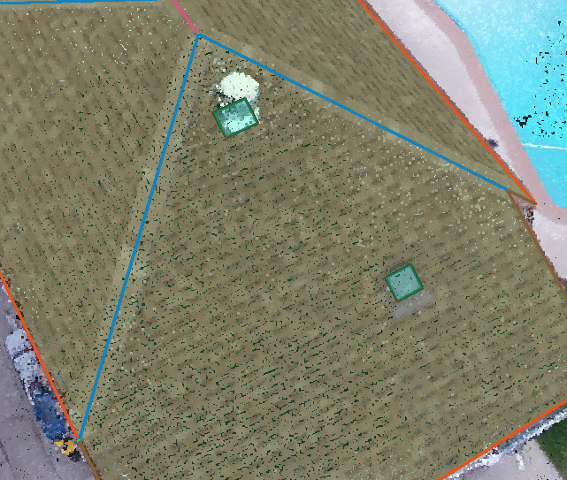

## Penetration:

> Penetrations are needed for Tesla projects, and you will see "label obstructions" in the description field of the projects.

1. Finish the entire roof first and get ready for the penetrations.
2. Start from one of the planes, open the 2D images first to count the total numbers of the penetrations to make sure you won't miss any penetrations in this plane. Lock this plane, go to [Vertex Mode](../mode/#vertex-mode) and draw a small square which covers the penetration.

   

3. Change to [Surface Mode](../mode/#surface-mode) and hold `Ctrl` to multi-select all the squares in this plane and [Attach](../tools/#attach) all the penetrations onto the parent plane. You will see the penetrations turn to blue and all the operations related to the penetrations are fixed in the plane now.

   

4. Then same as how to deal with the [Overhang](./#overhang). Lock the plane first, then you could either open the [Adjust Vertices](../advanced-function/#adjust-vertices) and adjust every corner one by one, or drag the vertex in the 3D view and check the vertices location in the 2D view at the same time, until all the vertices in this plane are adjusted.
5. Turn on the Edge Dimensions layer and [Align](../basic-function/#align) the relative edges to make sure the penetration is either a square or rectangle.
6. Open the [Adjust Vertices](../advanced-function/#adjust-vertices) and check every plane one by one in the 2D images to make sure there is not any missing penetrations.\(Any obstruction which will affect the setup of solar panel should be treated as penetration\)
7. [Detect Edge Types](../tools/#detect-edge-types) and you will see all the penetrations will turn to Step Flashing if they are attached correctly.

   

8. If the roof plane is changed or deleted, you may need to redo the penetrations since it is going to be detached or moved with the plane.

