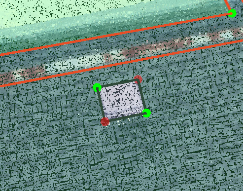

# Penetration

> Penetrations are needed for Tesla projects, and you will see "label obstructions" in the description field of these projects.

1. Finish the entire roof first before starting the penetrations.
2. Starting from one of the planes, open the 2D images first and count the total number of penetrations to make sure you don't miss any penetrations on this plane. Hold `Ctrl+Alt` and hover your mouse on the plane, you will see the primary edge is highlighted \(you could [Set Primary Edge](../tools/set-primary-edge.md) here\). Click your mouse to draw the anchor vertex, drag you mouse to change the size of the cutout and click your mouse again to settle down the location of the diagonal vertex.

   

3. The penetration will be attached to the plane automatically and it has a special property called Polygon Shape. All the parameters under Polygon Shape could be changed.

   

4. Lock the plane first, pick either one of the corners and adjust the vertex via 2D image using 1 image + locked plane mode. Pick the diagonal vertex and adjust this vertex under the same locked mode. Only two diagonal vertices are needed to be adjusted to fix the shape of the cutout.

   

5. Open the [Adjust Vertices](../advanced-function/#adjust-vertices) and check every plane one by one in the 2D images to make sure there is not any missing penetrations. \(Any obstruction which has a potential effect on setting up the solar panel should be treated as penetration, including the satellite dish and the pipes\)
6. [Detect Edge Types](../tools/#detect-edge-types) and you will see all the penetrations will turn to Step Flashing if they are attached correctly.

   

7. If the roof plane is changed or deleted, you may need to redo the penetrations since it is going to be detached or moved with the plane.

