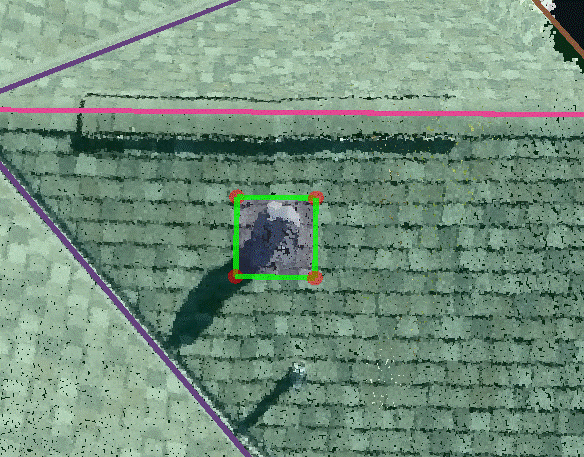
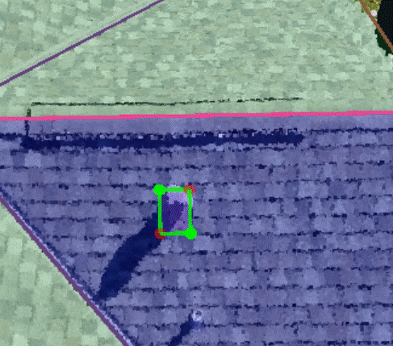
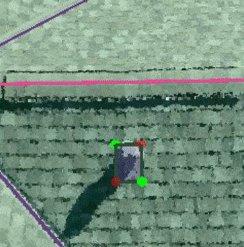

# Penetrations


Penetrations are required for Tesla projects only. You will see "label obstructions" in the description field on the intranet for these projects.


1. Finish the entire roof first before starting the penetrations.
2. Starting from one of the planes, open the 2D images first and count the total number of penetrations to make sure that none of the penetrations are missed on this plane. Hold `Ctrl+Alt` and hover the mouse on the plane. Notice that the primary edge is highlighted \(you could [Set Primary Edge](../tools/wireframe-tools/set-primary-edge.md) here\). Left-click to draw the anchor vertex, drag the mouse to change the size of the cutout and left-click again to place the location of the diagonal vertex.

   

3. The penetration will be attached to the plane automatically and it has a special property called Polygon Shape. All of the parameters under Polygon Shape can be changed.

   

4. Lock the parent plane first, pick either one of the corners and adjust the vertex via the 2D images using 1 Image + Locked Plane mode. Pick the diagonal vertex and adjust this vertex under the same locked mode. Only two of the diagonal vertices need to be adjusted, and applied, to set the shape of the cutout.

   

5. Open the [Adjust Vertices](../tools/adjust-vertices/) panel and check every plane, one by one, in the 2D images to make sure there are no missing penetrations. \(Any immobile obstruction which has a potential affect on setting up a solar panel should be treated as a penetration, including satellite dishes and pipes\)
6. Click [Detect Edge Types](../tools/wireframe-tools/detect-edge-types.md) and and all of the penetration edges will turn to Step Flashing if they are attached correctly. Keep in mind that chimney edges will also automatically be detected as Step Flashing and they will need to be manually changed to Flashing.

   

7. If the roof plane is changed or deleted, the penetrations may need to be recreated since they are going get detached or will have moved with the plane.


For penetrations that are the same type, like pipes and vents, an existing penetration can be copied \(Ctrl + c\) and pasted \(Ctrl + v\). Then the copied version can be moved to the new location. A penetration can also be dragged from one plane to another without having to make the same penetration on a different plane.


