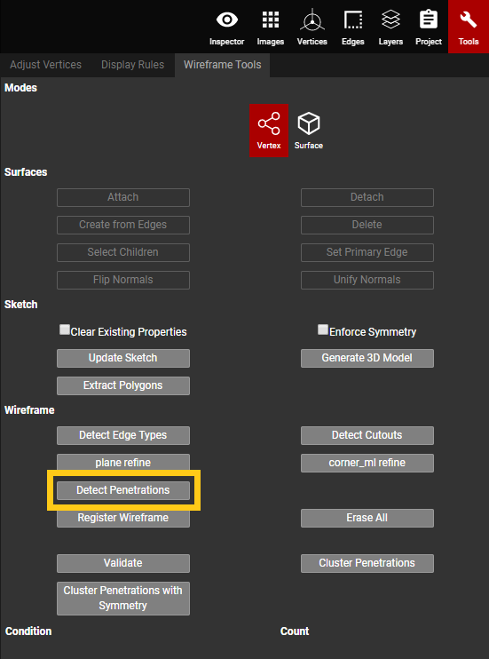
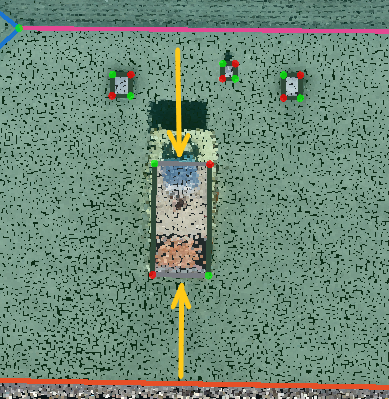
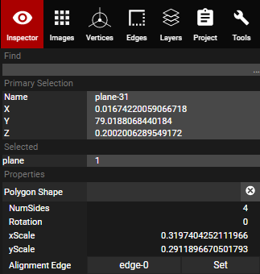
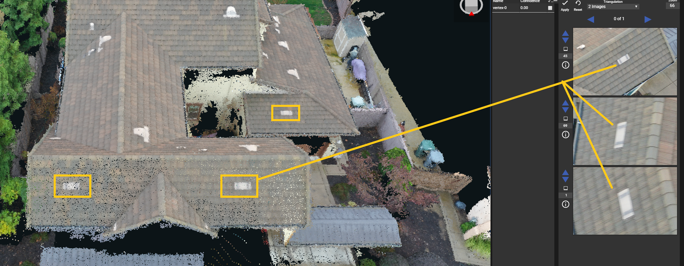
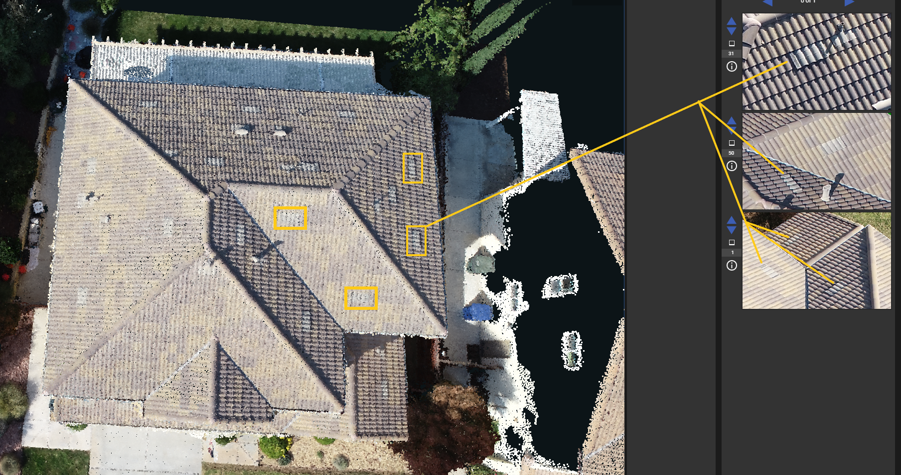
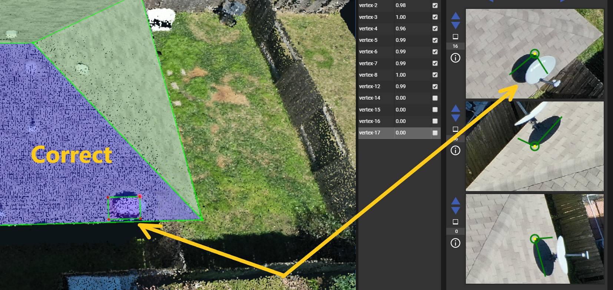
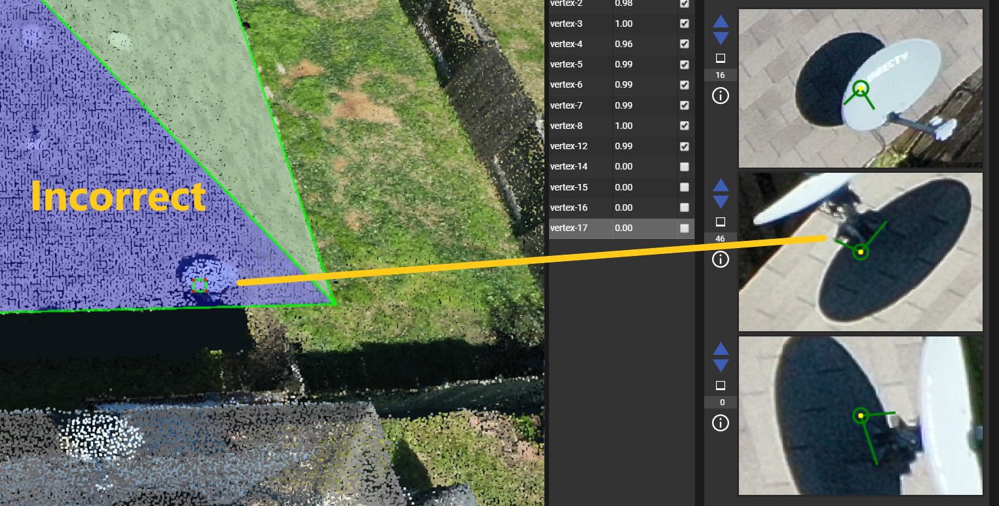

# Penetrations

There are two primary ways to create penetrations. The first is to manually create them, and the second is to use the Detect Penetrations feature. Instructions, tips, and tricks are listed below for each method.


Finish all other wireframing steps BEFORE completing the penetrations.



For DroneDeploy projects requiring penetrations, you will see "Enterprise" or "Add Obstructions" in the description field/column of the intranet. Please refer to this link for a detailed breakdown of DD description codes: [https://pointivo.atlassian.net/wiki/spaces/CO/pages/187662337/DroneDeploy+Description+Codes](https://pointivo.atlassian.net/wiki/spaces/CO/pages/187662337/DroneDeploy+Description+Codes)

Some DroneDeploy projects will require Obstruction Heights to be added to each penetration as well as any Trees casting a shadow on the roof. The link above will note which project descriptions require this. The links below show how to add Obstruction Heights and Trees: [https://pointivo.atlassian.net/wiki/spaces/CO/pages/337215515/How+to+add+obstruction+heights](https://pointivo.atlassian.net/wiki/spaces/CO/pages/337215515/How+to+add+obstruction+heights) [https://pointivo.atlassian.net/wiki/spaces/CO/pages/372408321/How+to+add+trees+for+solar+projects](https://pointivo.atlassian.net/wiki/spaces/CO/pages/372408321/How+to+add+trees+for+solar+projects)



Refer to this link for all other customer requirements on penetrations: [https://pointivo.atlassian.net/wiki/spaces/CO/pages/188907541/Customer+Wireframe+Project+Requirements](https://pointivo.atlassian.net/wiki/spaces/CO/pages/188907541/Customer+Wireframe+Project+Requirements)


### Manual Penetration Creation:

When a plane is locked, anything wireframed within that plane's boundaries will become a penetration of that plane. If the penetration is a shape that fits within a square/rectangular polygon, such as pipes, vents, and chimneys, then the penetration shortcut can be used. For oddly shaped penetrations, such as HVAC ductwork or L-shaped chimneys, the shortcut can still be used but it will take more than one polygon to account for all of the penetration's shape. Example: L-shaped chimneys would need to be broken into 2 penetration polygons, using the shortcut method, in order to cover all parts of the L-shape. In order to use the shortcut, the hotkeys must be pressed in a specific order.

* Lock the plane that the penetration will be attached to \(a.k.a the parent plane\)
* Hit and hold Alt + Ctrl -- alt must be hit first
  * With those still held down, left-click at the top left corner of the obstruction and release left-click; don't release Alt+Ctrl.
  * Continue holding Alt+Ctrl and drag your mouse down to the bottom right corner of the obstruction -- a polygon will start to form as the mouse moves to the bottom corner.
    * Left-click again, at the penetration's bottom right corner, and release Alt+Ctrl.
    * A penetration polygon will be on, and attached to, the parent plane.
* Each penetration will need to have 2 of its diagonal vertices adjusted, and verified, using Adjust Vertices. The other two unadjusted vertices will snap to their correct location with the movements of the adjusted ones.
  * **Turn off AutoLock when adjusting penetration vertices**.
  * Manually lock the parent plane and then adjust 2 diagonal vertices of the penetration. If AutoLock is on, then the penetration's plane will automatically lock when its vertices are selected. They must be adjusted on the locked parent plane instead.

As a last resort, penetrations can be created by drawing a polygon on, and within, another plane using the Create button. Lock the large/parent plane that the penetration is on, then use Create to place each vertex around the penetration and close off the polygon. That polygon automatically attaches itself to the larger plane and becomes a child/penetration of the parent plane. If the project is one that requires obstruction heights, then the Alt+Ctrl shortcut MUST be used.


Use the 2D images to count all of the penetrations in a project, and ensure that every object on the roof is accounted for with penetration polygons.


### Detect Penetrations:

One way to start finding all of the penetrations is to use Detect Penetrations in the Wireframe Tools tab of the Tools panel. This feature will find, and wireframe, all of the objects it detects as penetrations. Once the button is clicked, Detect Penetrations will start running, it will create a new branch called "Penetrations", and it will have the wireframe with the penetrations on that branch. When detect penetrations has finished running, open the penetrations branch and use Save As to save the penetration wireframe onto the qa branch.

* Every penetration that is detected needs to be checked to confirm it is actually a penetration. Detect penetrations will sometimes detect things like discolored shingles or random sticks/debris as penetrations, even though they're not.
  * Anything that is not a true penetration must be deleted -- select the surface of the penetration and hit Ctrl+Del to delete it.
* Each penetration will need to have 2 of its diagonal vertices adjusted, and verified using, Adjust Vertices. The other two unadjusted vertices will snap to their correct location with the movements of the adjusted ones.
  * **Turn off AutoLock when adjusting penetration vertices**.
    * Manually lock the parent plane and then adjust 2 diagonal vertices of the penetration. If AutoLock is on, then the penetration plane will automatically lock when its vertices are selected. They must be adjusted on the locked parent plane instead.

### **Penetration Edge Types**

All penetration edge types should be Step Flashing, except for those with wall edges that are parallel to ground -- such as chimneys. For chimney penetrations, the edges that are parallel to ground should be Flashing and the edges that are not parallel to ground should be Step Flashing. Detect Edge Types will detect all penetration edges as step flashing. The parallel-to-ground chimney edges will have to be manually changed to Flashing.

### Detached Penetrations

* If a parent plane is broken, or drastically altered, then the pentrations can become detached.
* Always check that all penetrations are attached. This can be done a couple of different ways.
  * The first way is to use [Select Children](../tools/wireframe-tools/select-children.md).
    * In surface mode, select the parent plane.
    * Go to the Wireframe Tools tab, in the Tools panel, and click the Select Children button.
    * All of the attached penetrations' planes will turn red -- any that are not red, on that specific parent plane, are not attached.
  * The second way is to turn off the Point Cloud and look at the colors of the penetration planes.
    * If the penetrations have a purple tint to them, then they are attached.
    * If the penetrations have a green tint to them, then they are detached.
  * The third way is to consult the project's Data Package.
    * In the data package if there is a very faint light-grey letter inside a penetration's wireframe, then that penetration is detached. All non-penetration planes will have a light grey letter inside of them, in the data package. Penetrations are meant to be holes in a plane. If they have a letter inside their wireframe, then they are not showing as holes and are forming their own separate plane instead.

### Polygon Shape Properties & Alignment Edge

When a penetration is created, using the shortcut, a Polygon Shape property is assigned to it. This property allows users to alter the rotation, number of sides, and the alignment edge of the penetration polygon.

The Alignment Edge behaves similarly to Set Primary Edge. However, Alignment Edge refers to the primary aligning edge of the individual penetration/polygon instead of the entire parent plane. To change a penetration's alignment edge: 

* In surface mode, select the penetration that needs to be realigned.
* In the Inspector panel, next to Alignment Edge, click Set.
* Click on the edge of the parent plane that the penetration polygon should be aligned to -- this will realign/reorient the penetration to be aligned with the desired edge


DO NOT use [AutoLock](../advanced-function/autolock.md) when adjusting penetrations. Manually lock the parent plane, and then adjust using the 2D images with 1 image + Locked Plane triangulation. AutoLock will lock the penetration's plane, not the parent plane that the penetration is attached to.



For penetrations that are the same type, like pipes and vents, an existing penetration can be copied \(Ctrl + C\) and pasted \(Ctrl + V\). Then the copied version can be moved to the new location. They can also be dragged from one plane to another without having to make the same penetration on a different plane.


### Special Cases:

**Flat vent penetrations** -- these are hard to see, so pay close attention and double check that they have been included as penetrations:

**Satellite Dish penetrations** -- The entire outline/footprint of the satellite dish needs to be included in the penetration polygon, not just the small area that penetrates the roof. Correct and incorrect image examples are shown below:

