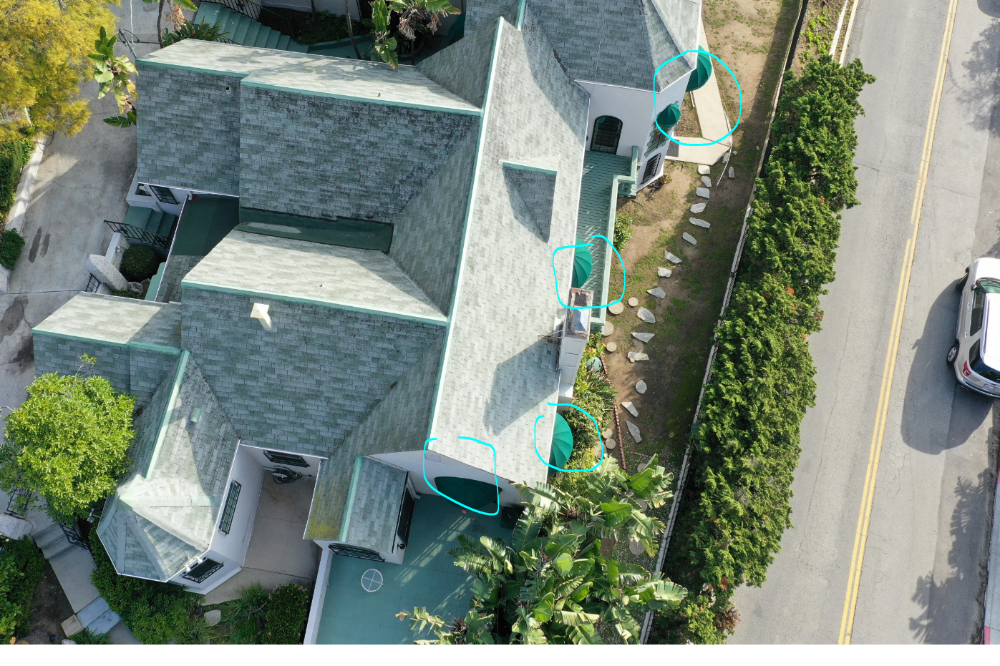
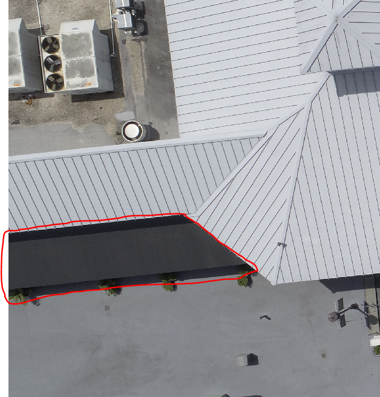
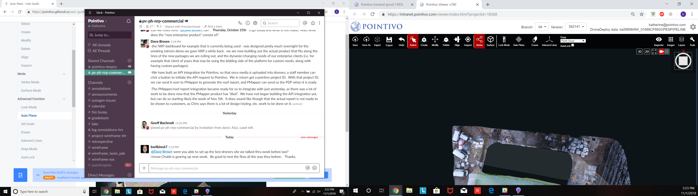
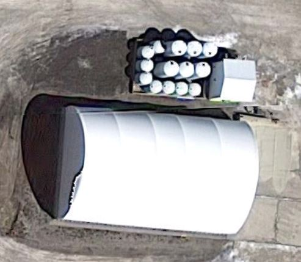

# Roof Materials to Ignore

There are a few types of roofing material that we do not support or wireframe. Example images from production projects are included below \(and will be updated as new materials are discovered/removed\):

* **Fabric Awnings:**

* **Wooden Awnings/Trellis:**

* **Fabric Gazebos:**

* **Rounded Shed/Greenhouse:**

