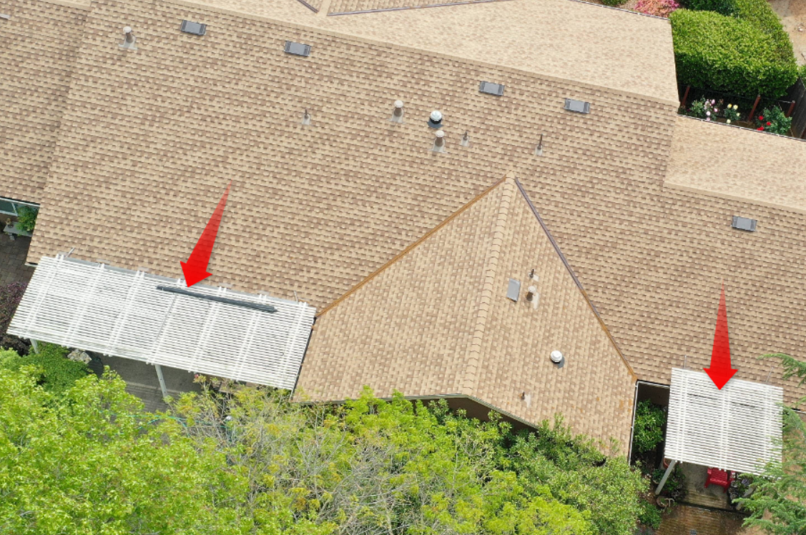

# Secondary Structures & Roof Materials to Ignore

Only a few types of secondary structures need to be included/wireframed in a project, several of them can be ignored. If the project has a ROI, and the secondary structure is included in it, then that structure needs to be wireframed. Pool houses, Garages large enough for a car, and Guest Houses should always be included unless the ROI specifically excludes it.

 There are also a few types of roofing material that we do not support or wireframe. Multiple example images of secondary structures and roof material types to ignore are shown below -- these will be updated as new examples are discovered/removed:

* **Fabric Awnings:**

* **Wooden Awnings/Trellis:**

* **Fabric Gazebos:**

* **Rounded Shed/Greenhouse:**

* **Straw Roofs**

