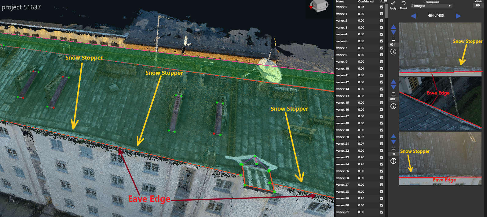

# Snow Stoppers

For some of the sloped, commercial roofs there will be metal Snow Stoppers near the bottom eave of the plane. When wireframing roofs like this, IGNORE the snow stoppers and take the wireframe all the way to the bottom edge of the sloped roof. The snow stoppers tend to look like the start of a gutter, like in the image below, and they may or may not be parallel to ground -- in this example, they are not parallel to ground


The 'Eave Edge' of this wireframe covers the bottom of the roof plane, ignoring the snow stoppers above the eave. These snow stoppers are slanted, and the portion of roof below the stoppers appears different than that above it -- however, all of the roof below the stoppers must be included in the wireframe


