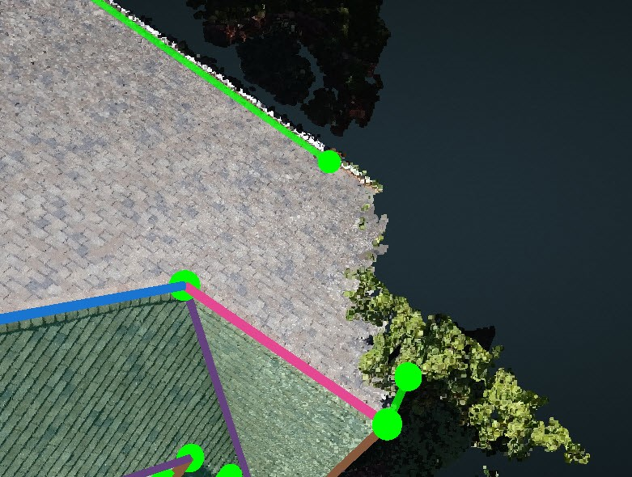

# Tree

> Tree shadows will destroy a part of the point cloud, usually it will be a corner.

1. [Create](../basic-function/#create) the two uncompleted edges near the corner.

   

2. Use [Intersect Lines](../advanced-function/#intersect-lines) to intersect the two edges to generate the corner point.
3. Turn on the Edge Dimensions layer to double check the dimensions of the corner location.

