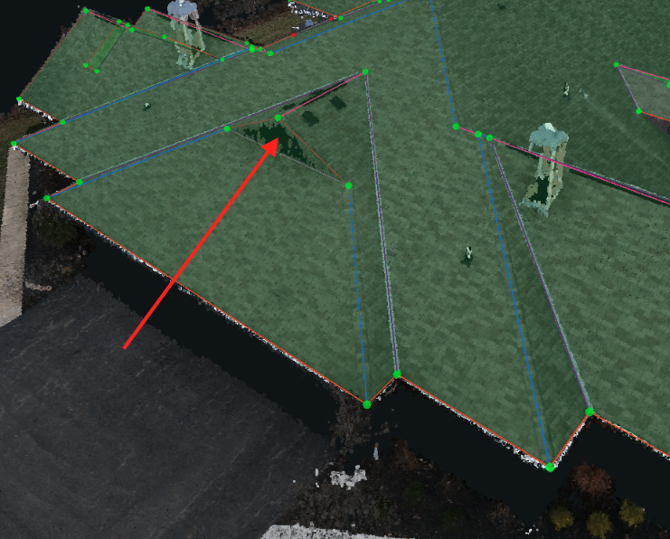

# Vertical Planes

A Vertical Plane is defined as a plane whose slope is greater than 80 degrees. If the vertical plane's slope is less than 80 degrees, it will be detected as a plane. You can select the plane in the tool and go to the properties to check the Slope number, and see if it will be detected.


A quick way to check for Vertical Planes is to turn off the point cloud layer \(P\) and look at the wireframe by itself. If there is a vertical plane, it will show up as the same green color as a normal plane.


Delete any "false" Vertical Planes in the 3Dtool since our system will not delete a plane with 79 degrees, even though you definitely want it to be deleted. The image below shows an example of a Vertical Plane that needs to be deleted.

