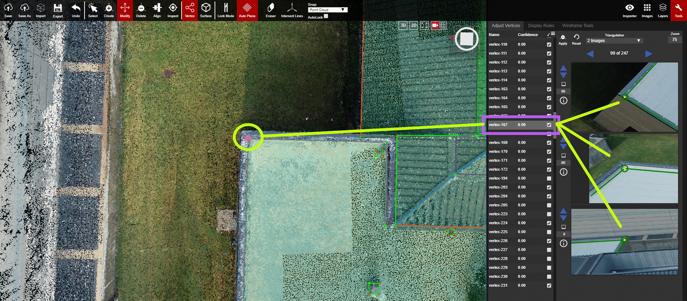

# Tools

The Tools panel includes 3 subgroups: [Adjust Vertices](adjust-vertices/), Display Rules, and Wireframe Tools.

  
[Adjust Vertices](adjust-vertices/) is the first tab within the Tools panel. It is used to adjust, and verify, the placement of the vertices.

