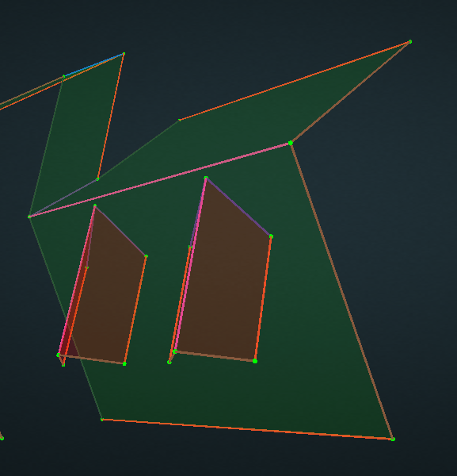
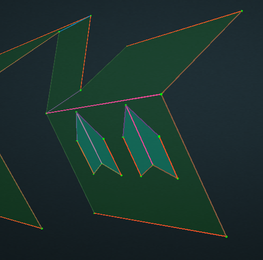
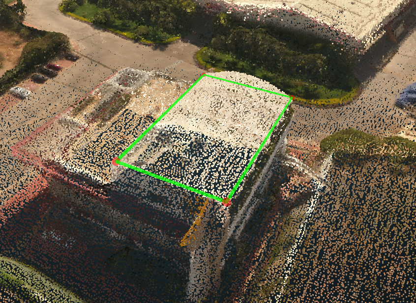
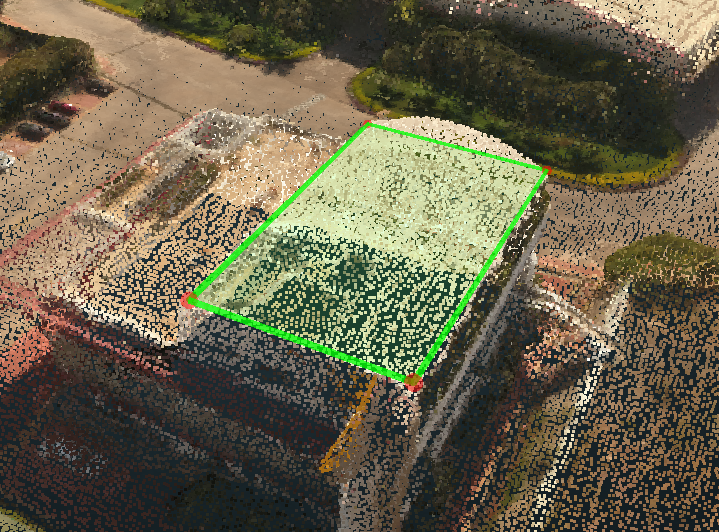
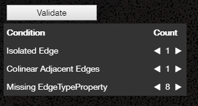

# Tools

## Attach:

1. Under [Surface Mode](../mode/#surface-mode), [Select](../basic-function/#select) or hold `Ctrl` to multi select the upper surfaces you want to attach.

   

2. With all the surfaces selected, click Attach and then click the lower surface which you would like the surfaces to attach to.
3. All the upper surfaces will be flat and attached to the lower surface. The attached surfaces will turn to blue.

   

## Detach:

[Select](../basic-function/#select) all the surfaces which have been attached and click Detach.

## Create from Edges:

1. [Select](../basic-function/#select) or hold `Ctrl` to multi select all the edges which should be on the same plane but not detected for any reasons.

   

2. Click Create from Edges, then the new plane will be created. And it will also turn off the [Auto Plane](../advanced-function/#auto-plane) which is on by default.

   

## Delete:

1. Under [Surface Mode](../mode/#surface-mode), [Select](../basic-function/#select) or hold `Ctrl` to multi select the planes you want to delete.
2. Click Delete, then the selected planes will be deleted. And it will also turn off the [Auto Plane](../advanced-function/#auto-plane) which is on by default.

## Detect Edge Types:

It will add a new Edge Type Property into each edge and assign the detected edge type to this property.

Note: It is not going to overwrite any assigned edge type property. To redetect all the edge types, you need to select all the edges and delete all the edge types first.

## Detect Cutouts:

It is going to detect all the cutouts in the scene and [Attach](./#attach) the cutouts plane into the lower plane.

## Finalize:

Finalize is going to [Detect Cutouts](./#detect-cutouts) and [Detect Edge Types](./#detect-edge-types).

## Plane Refine:

## Corner Refine:

## ML Refine:

Machine learning is going to tweak the location of each vertices. It will save the current the current wireframe as a Rough wireframe in the current branch. And once it is done, it will save the refined wireframe as a new Wireframe-3-Java version under Autogen branch.

## Validate:

This button is going to trigger an automatic validation to check the quality of the wireframe.

Clicking the each condition will select all the objects with the error and focus the camera into all these objects at the same time. The arrows under Count could help you scroll all the objects.

Different Errors are as follows:

| **Condition** | **Intro** |
| --- | --- |
| Isolated Vertex | Vertex does not belong to any edges |
| Isolated Edge | Edge does not belong to any plane |
| Coincident Vertices | Two vertices are too close with each other |
| Colinear Adjacent Edges | Extra vertex in the middle of the edge |
| Missing EdgeTypeProperty | Edge does not have edge type |

