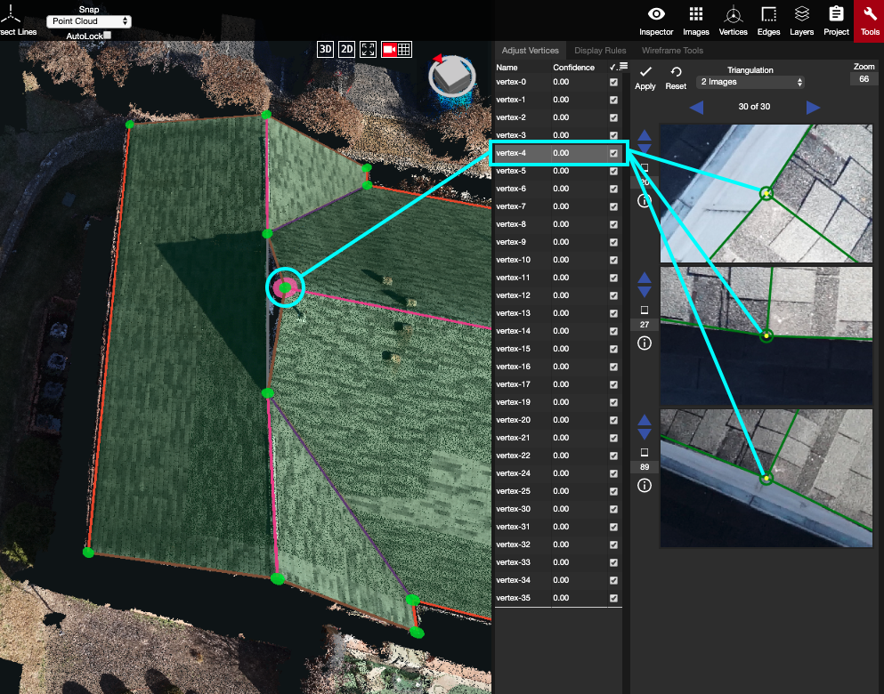

# Adjust Vertices

Adjust Vertices is the first tab within the Tools panel. It is used to adjust, and verify, the placement of the vertices by triangulating them on the point cloud using the 2D images. Using triangulation allows us to pinpoint the vertex's exact location within the point cloud's coordinates, and achieve our accuracy goal of being within 5cm \(or 2"\) of the true edge measurements.

The process of adjusting vertices occurs once the rough wireframe has been created and refined. Utilize the 2D images, Plane Sort, and the [Triangulation](triangulation.md) modes to adjust the vertices to their correct locations.


If the vertex is dragged in the 3D view, the projected location will change in the 2D images at the same time. After adjusting the vertex in the 2D images, use the Apply \(A\) button or hotkey to implement the adjustment. The vertex will turn from unverified \(red\) to verified \(green\).


### Plane Sort

In the top right corner of the vertex list, there is a drop-down list. This list contains **Plane Sort** and also allows users to control the visibility of the columns in the Adjust Vertices tab. Plane Sort is important because it allows users to adjust vertices while locked to their largest plane. When plane sort is clicked, the vertices will be re-sorted according to the size of the planes, [AutoLock](../../advanced-function/autolock.md) will automatically turn on, and the [Triangulation](triangulation.md) will switch to 1 image + Locked Plane.


The planes must be reliable in order for the vertices to adjust properly with Plane Sort.


Since AutoLock is on, each vertex will only need to be adjusted in one of the 2D images. While the mouse is active in the 2D image windows, the shortcut keys can be used to Apply, Shuffle, and go to the Next, or Previous, vertex.  

* To **Apply** a movement: hit **A** while active in a 2D image window
  * There is also an "Apply" button to the left of the Triangulation dropdown menu
* To go to the **Next** vertex: hit **N** while active in a 2D image window
  * hitting N will automatically apply any adjustments and switch to the next vertex in the list
  * the right blue arrow at the top of the 2D image windows will also go to the next vertex, and apply any new adjustments
* To go to the **Previous** vertex: hit **P** while active in a 2D image window
  * hitting P will automatically apply an adjustments and then go to the previous vertex in the list.
  * the left blue arrow at the top of the 2D image windows will also go to the previous vertex, and apply any new adjustments
* To **Shuffle** the 3 images of a vertex: hit **S** while active in a 2D image window
  * to shuffle only 1 image, click the up or down blue arrow next to the 2D image 


These hotkeys work the same, regardless of the Triangulation mode.


Occasionally, adjustments need to be made that require a plane to be locked other than the plane chosen by Plane Sort and AutoLock. The best way to rectify this is to turn off AutoLock, by unchecking its box, and manually lock a different plane to adjust the vertex. If locking a new plane also doesn't do the trick, then using 2 or 3 Image [Triangulation](triangulation.md), without any planes locked, will be the best way to adjust the vertex into the right location.

To exit Plane Sort, click on 'Name' or 'Confidence' at the top of the vertex list. This will make the vertex/confidence columns revert back to their original state and will automatically turn off Auto Lock.

AutoLock can also be turned off manually, with Plane Sort still intact, by unchecking the box below the Snap mode dropdown.

