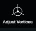

# Adjust Vertices

Here are the articles in this section:


This page is under construction to get a better layout.


Open the Adjust Vertices panel and click the vertex you would like to adjust.


If you drag the vertex in the 3D view, the projected location will be changed in the 2D view at the same time. After the adjustment, use the Apply button to implement your adjustment and the verified vertex will turn from Red to Green.


