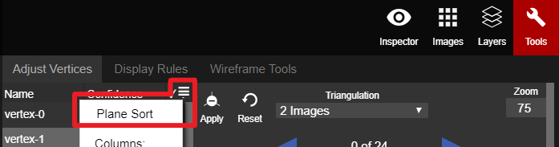

# Plane Sort

In the top right corner of the vertex list, there is a button that allows users to utilize Plane Sort and control the visibility of the different columns in the Adjust Vertices tab.

When plane sort is clicked, the vertices will be sorted according to the size of the planes. [AutoLock](../../advanced-function/autolock.md) will automatically turn on at the same time.

Since AutoLock is on, the user can use the blue Left and Right arrows to go through all of the vertices. Each vertex will need to be adjusted in only one of the 2D images.

Sometimes issues arrive in a plane and it no longer matches the point cloud. The best way to rectify this is to turn off AutoLock and readjust the vertices using 2 or 3 Image Triangulation.

To exit Plane Sort, the user can click on any column to resort back to the original vertices list. The box underneath the Snap drop-down menu, in the main toolbar, can be unchecked to turn off AutoLock.


When using Plane Sort to adjust the vertex, first you need to make sure all of the planes are reliable.


