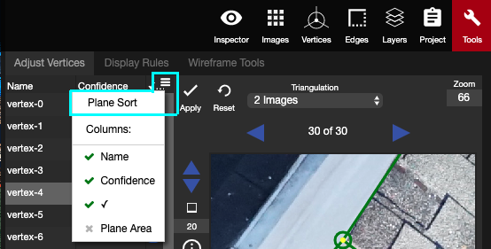

# Plane Sort

In the top right corner of the vertex list, there is a button that allows users to utilize Plane Sort and control the visibility of the different columns in the [Adjust Vertices](./) tab.

When plane sort is clicked, the vertices will be sorted according to the size of the planes. [AutoLock](../../advanced-function/autolock.md) will automatically turn on at the same time.

Since AutoLock is on, the user can use the blue Left and Right arrows to go through all of the vertices. Each vertex will need to be adjusted in only one of the 2D images. While hovering over the 2D images, the A, S, and N keys can be used to Apply \(A\) any movements in the 2D image, Shuffle \(S\) the 3 images, or go to the Next \(N\) vertex in the list. Hitting N will automatically apply any movements that were made in the 2D images, and it will move on to the next vertex in the list.

Occasionally, adjustments need to be made that require a plane to be locked that is not the plane chosen by Plane Sort and AutoLock. The best way to rectify this is to turn off AutoLock, manually lock a different plane and readjust the vertex in one of the 2D images. If locking a new plane also doesn't do the trick, then using 2 or 3 Image [Triangulation](triangulation.md), without any planes locked, will be the best way to adjust the vertex into the right location.

To exit Plane Sort, click on 'Name' or 'Confidence' at the top of the vertex list in the Adjust Vertices panel. This will make the vertex/confidence columns revert back to the non-Plane Sort state. This will also automatically turn off Auto Lock.

AutoLock can also be turned off manually, with Plane Sort still intact, by unchecking the box below the Snap mode dropdown.


When using Plane Sort to adjust the vertex, you first need to make sure all of the planes are reliable.


