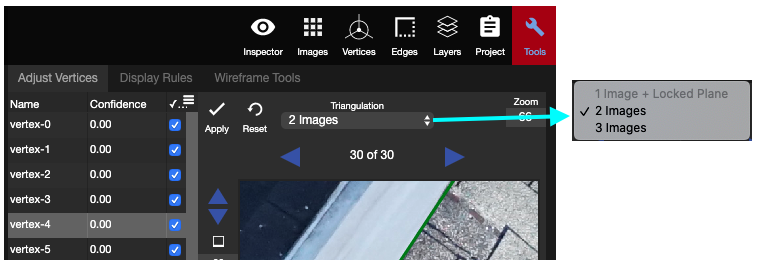

# Triangulation

* **1 Image + Locked Plane:** Under this Triangulation, only 1 image is needed to adjust the vertex. The vertex will be fixed on the locked plane, and its location will be changed based on the selected 2D target. When AutoLock is on, or a plane is manually locked, then this Triangulation will automatically turn on.
* **2 Images:** This is the default Triangulation of the tool. The vertices have to be adjusted in 2 of the three images, and will be projected onto the third image at the same time. Remember to scroll through the images to find the best 2.
* **3 Images:** This Triangulation uses all three images to project the vertex location in the 3D view. The vertex location can be seen on any of the other images if you Scroll through the images. This mode is only used on the Accuracy Study or when the projection error is big.


To shuffle all three images at the same time, tap S while the mouse is hovered over any of the 2D image windows.



To shuffle one of the 2D image windows individually, click on the up or down blue arrows to the left of the image.


