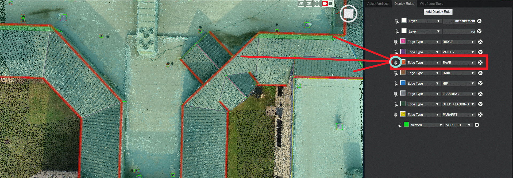

# Display Rules

The Display Rules subgroup shows all of the names and corresponding color codes assigned to the various properties of the wireframe.

In the image above, the white arrow in the blue circle was clicked and it selected all of the Eaves on the wireframe since that is the property it's assigned to.

