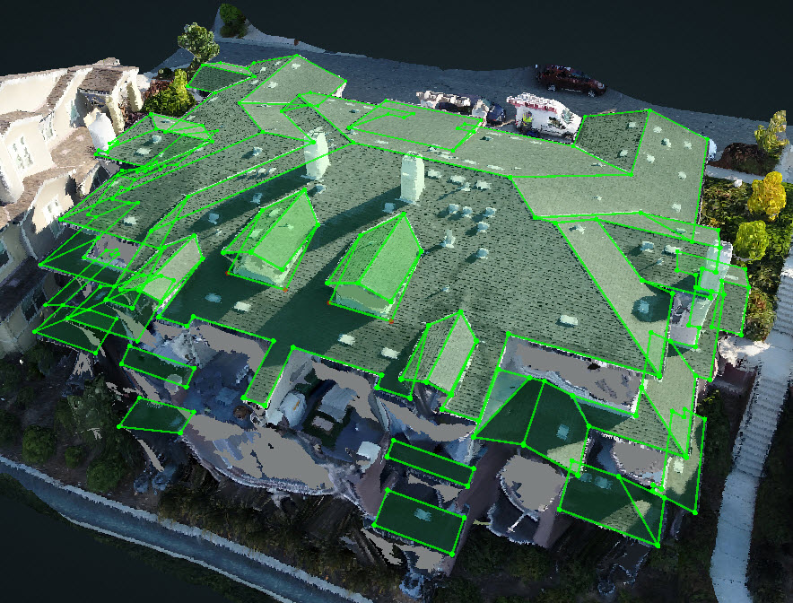

# Penetrations Refine

 Penetrations Refine occurs once the roof structure wireframe is completely done.

The Penetrations Refine button in the Tools is going to detect all the penetrations automatically.

Under a new Branch called Penetrations, you will see the new version with Penetrations

There might be some extra or missing penetrations and some of the penetrations may not be accurate, but it is a good start and Brad 👨‍💻 is working on the improvements.

