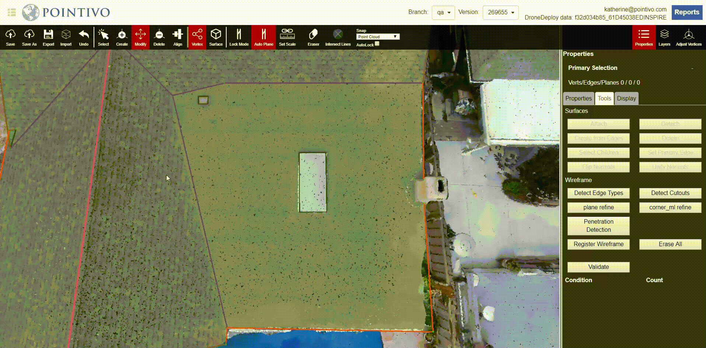

# Set Primary Edge

Every plane has a Primary Edge that is automatically detected. This edge will be the one that is the most parallel to the ground, it won't necessarily be the largest edge. Any attached penetrations, specifically drawn by the Alt + Ctrl shortcut, are going to be aligned with this defaulted primary edge.

However, in some specific cases, the primary edge might be incorrect or we may want the penetrations to align with a different edge in the given plane. In those scenarios, we can manually set the primary edge by using the Set Primary Edge button.

1. While in Surface Mode, select the Plane that contains the desired Primary Edge.
2. Click Set Primary Edge.
3. Select the Edge you would like to set as primary \(you do not need to switch to Vertex mode here\).
4. The selected edge is now set as the Primary Edge for this Plane.

