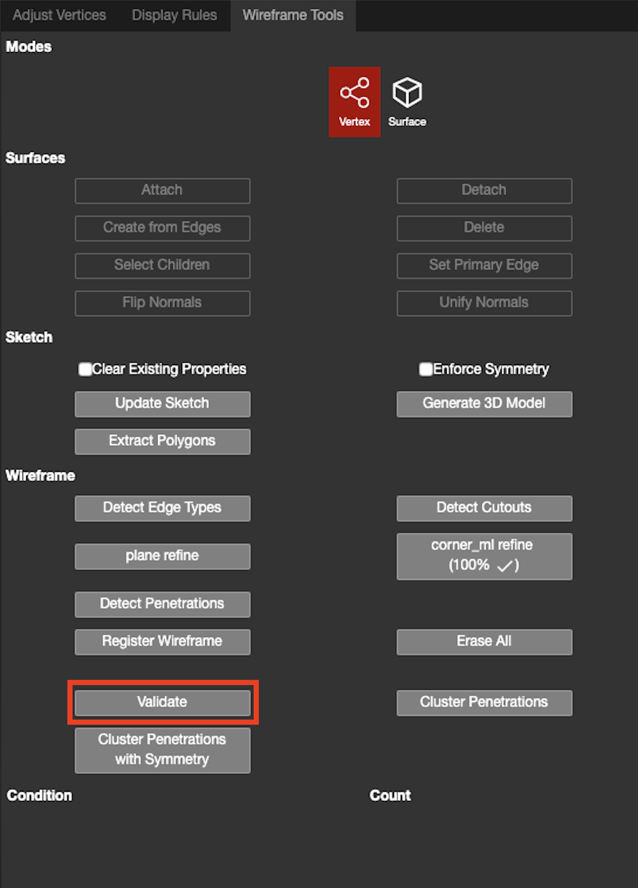

## Validate:

This button is going to trigger an automatic validation to check the quality of the wireframe.

Clicking the each condition will select all the objects with the error and focus the camera into all these objects at the same time. The arrows under Count could help you scroll all the objects.

Different Errors are as follows:

| **Condition** | **Intro** |
| --- | --- |
| Isolated Vertex | Vertex does not belong to any edges |
| Isolated Edge | Edge does not belong to any plane |
| Coincident Vertices | Two vertices are too close with each other |
| Colinear Adjacent Edges | Extra vertex in the middle of the edge |
| Missing EdgeTypeProperty | Edge does not have edge type |