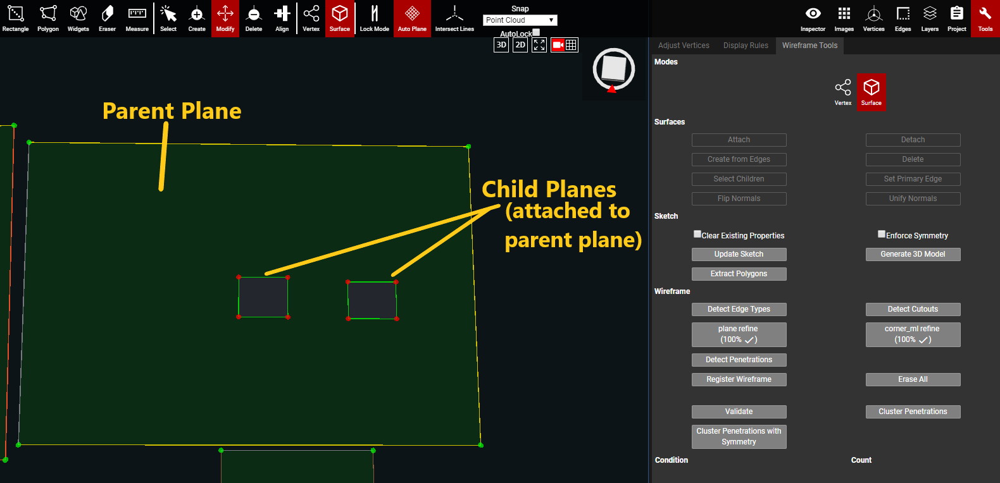
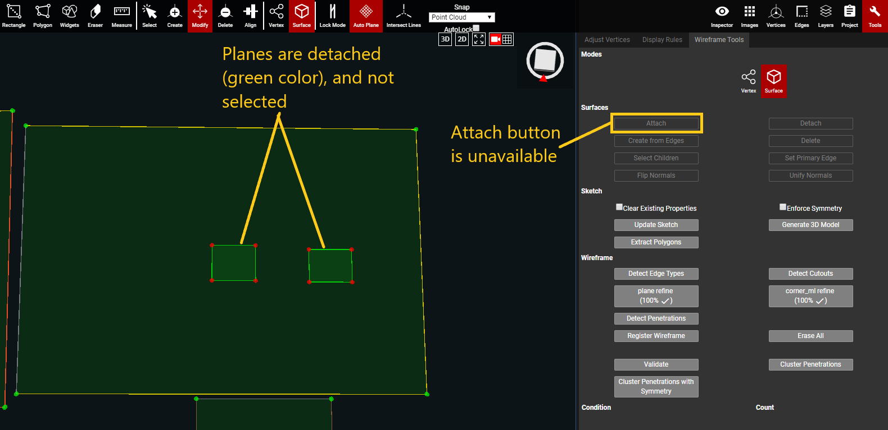
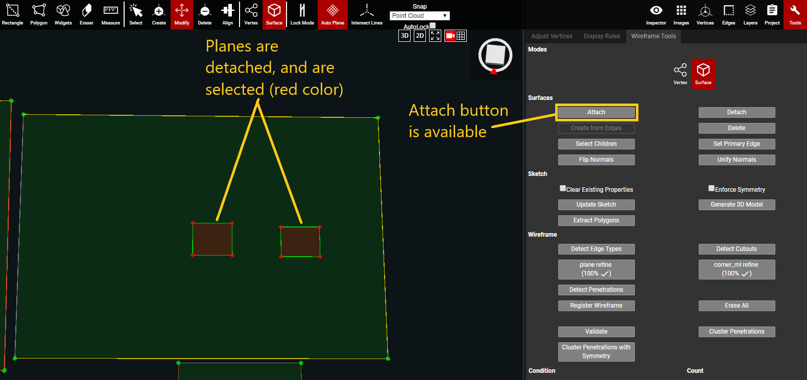
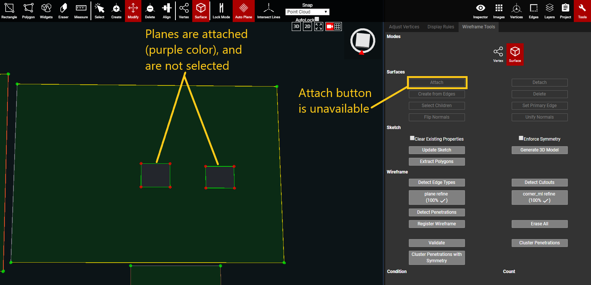

# Attach

This feature will attach one, or more, surfaces to a different surface. The surface that gets attached is considered the Child Plane. The surface that receives an attachment is the Parent Plane. Once the planes are attached, the child plane becomes a cutout, or penetration, of the parent plane. In the wireframe dxf file a child/penetration/cutout plane is shown as a "hole" in the wireframe. The surface area of the child plane is deducted from the overall surface area of the parent plane.

Attach is very useful for situations that cause penetrations to become detached, such as a parent plane being modified and/or broken. Or if there is an opening in the middle of a roof plane for something like a balcony, then a child plane would need to be attached to show there is a cutout/hole in the middle of that plane.

**Attach only works in** [**Surface mode**](../../mode.md)**.**


Hotkey: Ctrl + D -- select the detached planes first, then hold Ctrl + D and click on the parent plane to attach. \(the attached planes become children of the parent plane\)


#### Attach Example:

* While in Surface mode, select the planes that are going to be attached to the parent plane. If a plane is the normal, light green color, then it is not attached to anything.
  1. Multiple planes can be selected, but they all have to get attached to the same parent plane. 
  2. Use Ctrl to select multiple planes.

* With all of the planes selected, click the Attach button, and then click on the parent plane that the selected planes will be attached to.
* All of the selected planes will attach to the parent plane, and become children of the parent plane. The child/children planes will also turn purple instead of the normal, green, plane color. This purple color signifies that they are correctly attached to the parent plane.

