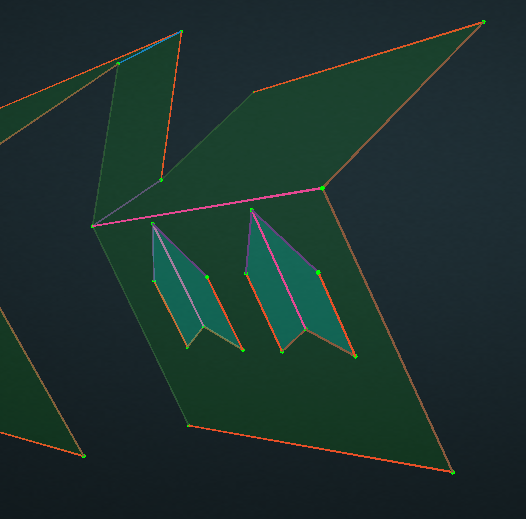

# Attach

This feature will attach one, or more, surfaces to a different surface. The surface that gets attached is considered the Child Plane. The surface that receives an attachment is the Parent Plane. The child plane becomes a cutout in the parent plane when they are attached. 

Attach is very useful for situations that cause penetrations to become detached, such as a parent plane being modified or broken. If a plane is the normal light green color, then it is not attached to anything.


Attach only works in Surface mode.


1. While in Surface mode, select the child plane that is going to be attached to the parent plane. Multiple child planes can be selected, but they all have to get attached to the same parent plane. Use Ctrl to select multiple child planes.
2. With all of the child planes selected, click the Attach button, and then click on the parent plane that the child planes will be attached to.

All of the child planes will flatten and attach to the parent plane. The child planes will also turn blue/purple instead of the normal green plane color. This signifies they are correctly attached and are now a cutout of the parent plane.


Hotkey: Ctrl + D -- select the child planes first, then hold Ctrl + D and click on the parent plane


