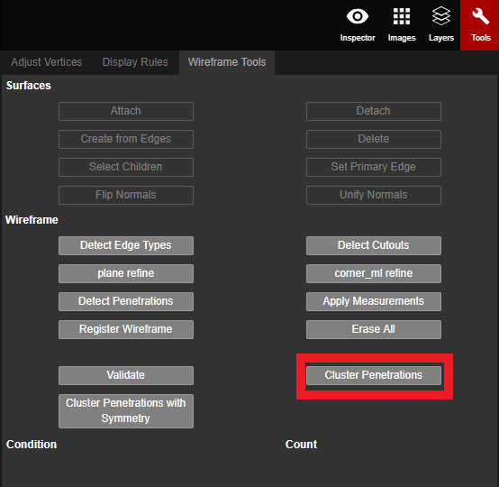

# Cluster Penetrations

Cluster Penetrations classifies all of the penetrations in a project and assigns labels to them as well. The labels can range from 0 to 20, depending on the size \(with 0 being the smallest and 20 being the largest\). All penetrations of the same type will be assigned the same label.


Cluster Penetrations would be completed after Detect Penetrations is finished, but before Cluster Penetrations with Symmetry and before adjusting the penetration vertices.


