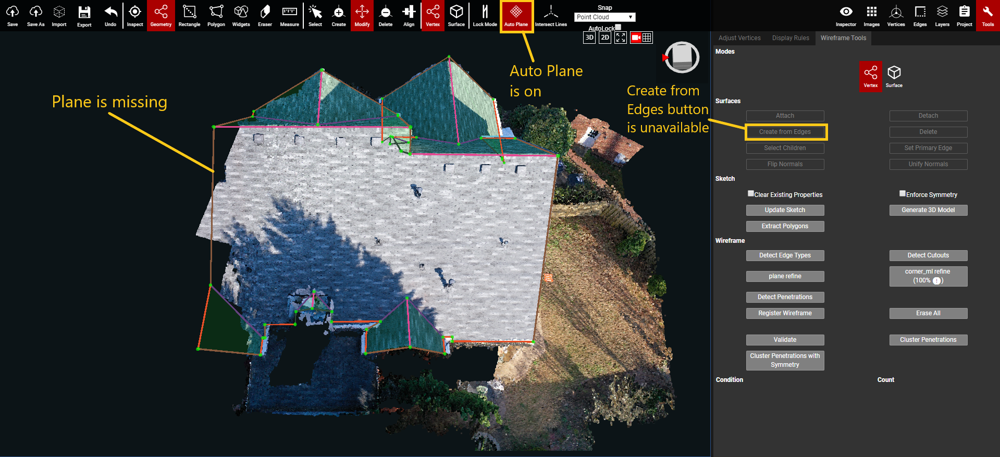
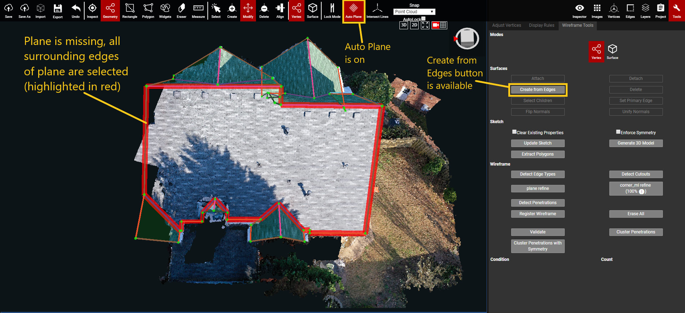
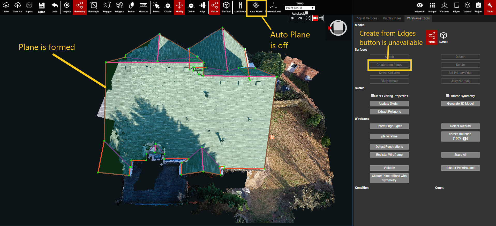

# Create from Edges

Create from Edges is used to manually create a plane that did not form automatically with [Auto Plane](../../advanced-function/auto-plane.md). Generally speaking, if a plane does not form on its own, then that's usually a sign that the plane is not planar. This can be due to crooked edges, or vertices pulling the plane in an unnatural direction. Before resorting to using Create from Edges, first check that all of the plane's edges and vertices are aligned along the same angle. Looking at the plane from its side view will point out any obvious vertices that are breaking the planarity. If the plane still doesn't form after fixing those visible issues, then Create from Edges must be used to form the plane.

**Create from Edges only works in** [**Vertex mode**](../../mode.md)**.**


Do NOT use Create from Edges until after the wireframe has been fully roughed and plane refined (if necessary). **Auto Plane will turn off** once Create from Edges is used. Anything added to the wireframe afterward will not form planes automatically.



If Auto Plane is turned back on after using Create from Edges, then all planes that were manually created will disappear.&#x20;

To view the correct wireframe of a project that has manually created planes: Open the qa branch, turn off Auto Plane, open the Version dropdown menu, click on the most recent Version of the project. This will reload the wireframe to include all of the manually created planes made by Create from Edges.


#### Create from Edges Example:

1. In [Vertex mode](../../mode.md), hold Ctrl and select all of the edges that are surrounding the missing plane.
   1. The Create from Edges button will be unavailable until all surrounding edges, that form the missing plane, have been selected.

2\. Click Create from Edges, and the new plane will be created. [Auto Plane](../../advanced-function/auto-plane.md) will also turn off since it was on by default. Any planes that need to be formed using Create from Edges, should be created at the end of the Adjust Vertices process. Since Auto Plane will be turned off, any new planes created in the wireframe after this step will not be automatically detected -- they will have to be manually created as well.

