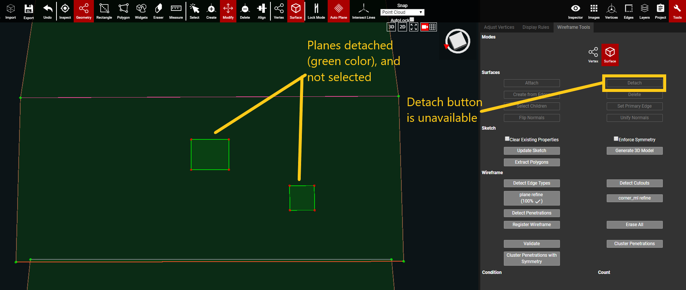

# Detach

This feature is used to separate two, or more, attached planes. Sometimes when wireframing a new plane above an existing plane, the new plane will automatically attach itself to the existing one. This can happen if the point cloud is sparse and if it's a very short distance between the 2 planes' overlap. To remedy this, the Detach button is needed.


Detach only works in [Surface mode](../../mode.md).


While in Surface mode, click on the child planes that need to be detached and then click the Detach button. The newly detached planes will turn green to show that they are no longer attached to the parent plane. Child planes can also be known as penetrations or cutouts. In the wireframe dxf file a child plane, penetration plane, and cutout plane are all shown as holes in the wireframe. The surface area of the child plane is deducted from the overall surface area of the parent plane.

#### Detach Example:

