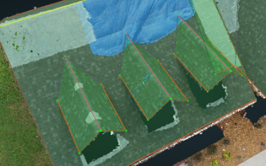
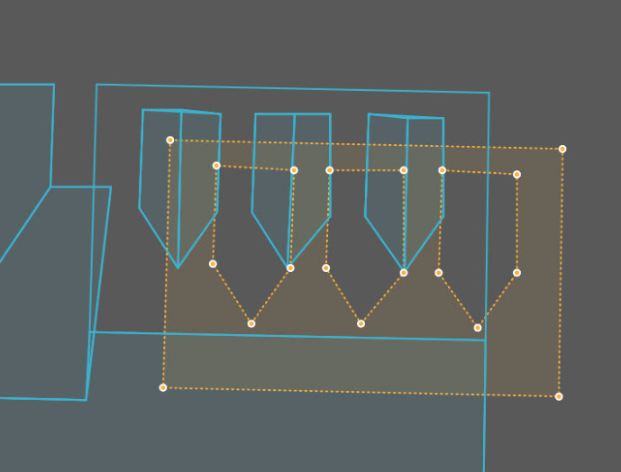

# Detect Cutouts

The Detect Cutouts button will detect all of the cutouts in the scene and will [Attach](attach.md) the cutouts plane onto the lower plane. The best example of this is detecting the cutouts of dormers.

* First, finish the dormer as normal. There is no need to draw the outline of the shadow that is underneath the dormer in the lower plane.
* Lock the plane and adjust the top three vertices of each dormer.

* In the Wireframe Tools tab of the Tools panel, click Detect Cutouts. The base of the dormer automatically be wireframed as a cutout of the parent plane.
* After saving and generating the resources, make sure to double check that the dormer cutouts were detected in the GeoJSON.

