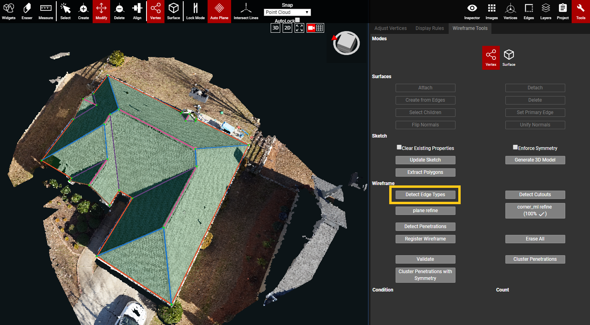

# Detect Edge Types


For rules on edge types, and special cases for them, please refer to the [Edge Types & Requirements](../../edge-types.md) section of the User Guide.


The purpose of the Detect Edge Types button is to automatically detect and assign edge types to all of the unassigned edges in a wireframe. If there are edges that already have an assigned edge type, then this button will not override that previous assignment.

\*\*The [Edges panel](../../edges.md) also has a Detect Edge Types button. However, this section of the User Guide is solely focused on the Detect Edge Types button in the Wireframe Tools tab of the Tools panel \(shown below\).

* To manually apply an edge type to an unassigned edge, an Edge Type Property but be added to the edge:
  * Select an unassigned edge and open the [Inspector panel](../../properties.md).
  * Open the Add Properties dropdown menu, and select Edge Type.
  * Click to the right of the Edge Type property to open the edge type dropdown menu. Choose the desired edge type to assign to the selected edge.
* To change the Edge Type of an edge that has already been auto-assigned: 
  * Select the edge that needs to be changed, and open the Inspector panel or the Edges panel.
  *  Open the edge type dropdown menu, and choose a new edge type for the selected edge/edges
* **The video below shows how to change an edge type using the edge type dropdown menu from both the** [**Inspector panel**](../../properties.md) **and the** [**Edges panel**](../../edges.md)**:**

