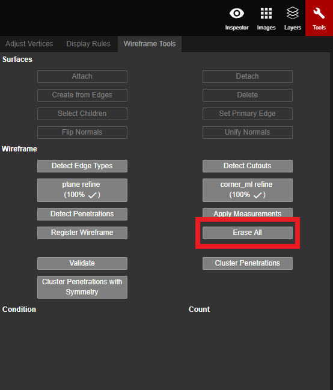

# Erase All

Erase All will erase all of the vertices, edges, and planes on the screen.

This tool is useful when the autogen wireframe is completely unaligned with the structure, or when it has wireframed additional structures and unnecessary objects such as trees. A large amount of excess vertices and edges can make it more time consuming to use [Delete](../../basic-function/delete.md) or [Eraser](../../advanced-function/eraser.md), because both tools only erase individual vertices and/or edges.

