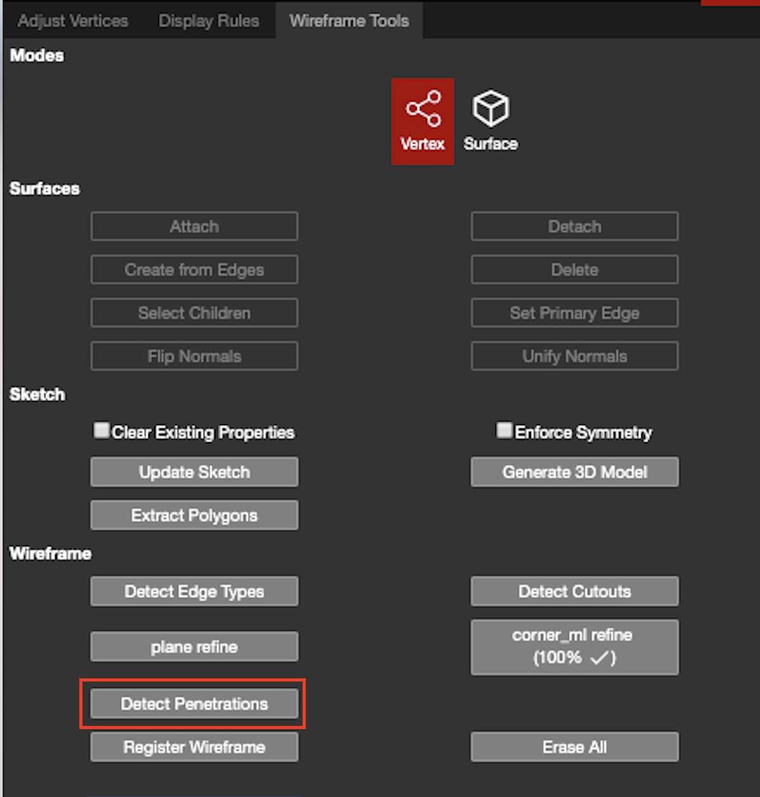

# Detect Penetrations


Please refer to this link to find out which projects require penetrations: [https://pointivo.atlassian.net/wiki/spaces/CO/pages/188907541/Customer+Wireframe+Project+Requirements](https://pointivo.atlassian.net/wiki/spaces/CO/pages/188907541/Customer+Wireframe+Project+Requirements)

Please refer to this link for a detailed breakdown of DroneDeploy's description codes: [https://pointivo.atlassian.net/wiki/spaces/CO/pages/187662337/DroneDeploy+Description+Codes](https://pointivo.atlassian.net/wiki/spaces/CO/pages/187662337/DroneDeploy+Description+Codes)


The Detect Penetrations button is used to automatically detect all of the penetrations on a structure's roof after the wireframe has been adjusted and verified. This button should not be pressed until all other parts of the project are completed. This feature will not detect [Dormers](../../special-cases/dormer.md) as penetrations; those will only be detected if the [Detect Cutouts](detect-cutouts.md) button is used.

Once Detect Penetrations is finished, there will be a new branch created called Penetrations and a new version to go along with it.

**If the project is closed while Detect Penetrations is running**, then the newly created Penetrations branch will need to be opened first when Detect Penetrations completes. This will automatically load the new version created with the penetrations branch. Once it's loaded, hit Save As and select the qa branch to save this penetrations branch onto the qa branch. Any subsequent opening of the qa branch will have the penetrations version saved on it.

**If the project is left open while Detect Penetrations is running**, then the user will need to manually select, and switch to, the Penetrations branch when Detect Penetrations completes. Once the Penetration branch is selected, the user must also manually select the most current version of the penetration branch. After they're loaded, hit Save As and select the qa branch to save this penetrations branch onto the qa branch. Any subsequent opening of the qa branch will have the penetrations version saved on it.

\*\*There might be some extra, or missing, penetrations and some of the penetrations may not be accurate, but the process is constantly being updated and improved.

