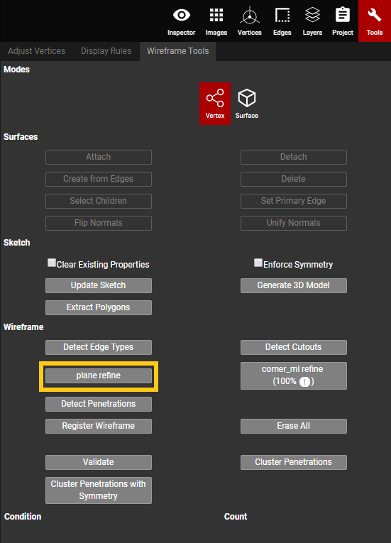

# Plane Refine

Plane Refine is used to clean up the planes of a roughed wireframe. If there is no autogen created on the point cloud, or if the autogen is bad, then plane refine will make adjustments to ensure the roughed wireframe is planar.

When the Plane Refine button is clicked, the current wireframe gets saved in the qa branch as a new version named "Rough". The Machine Learning system modifies this wireframe by calculating the plane equations and optimal views for the roughed polygons, and predicting the refined corner locations based on the cropped 2D images. This results in a refined wireframe with planes that are planar. Once the Plane Refine process is complete, the newly refined wireframe will be saved under the Autogen branch with a new version named "Wireframe-4-Java".

**If the project is closed while Plane Refine is running**, then the Autogen branch will need to be opened first when Plane Refine completes. This will automatically load the newly refined Wireframe-4-Java version of the wireframe. Once it's loaded, hit Save to switch this refined Wireframe-4-Java version over to the qa branch. Any subsequent opening of the qa branch will have the refined version saved on it.

**If the project is left open while Plane Refine is running**, then the user will need to manually select, and switch to, the Autogen branch when Plane Refine completes. Once the Autogen branch is selected, the user must also manually select, and switch to, the Wireframe-4-Java. After they're loaded, hit Save to switch back to the qa branch and keep the Wireframe-4-Java version set on the qa branch. Any subsequent opening of the qa branch will have the refined version saved on it.


**Always lock the planes** before adjusting vertices on the plane refined wireframe. If the planes aren't locked, then the refined wireframe won't be reliable/accurate and the planes will no longer be planar. It defeats the purpose of running plane refine.


