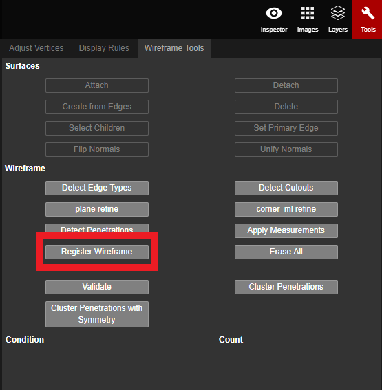

# Register Wireframe

When an imported wireframe is not covered on the point cloud \(due to differing coordinates\), the Register Wireframe feature can be used to move, rotate, and snap the wireframe onto the point cloud.

1. Create a new edge from the imported wireframe, and connect it to the same point in the point cloud. Then use [Adjust Vertices](../adjust-vertices/) to adjust the endpoint and ensure it is in the accurate location.
2. Repeat Step 2 for each different point, until there are 4 new edges.

1. Hold `Ctrl` to select all 4 edges and click the Register Wireframe button in the Tools tab of Properties.


Updated Video Coming Soon!



The vertices of the wireframe you are registering will already be verified from the original project it was exported from. You still need to go through and check the placement of the vertices after clicking Register Wireframe to re-verify that they are indeed in the correct location. You may need to use Adjust Vertices to tweak some of the vertex locations to make them more accurate. This is why it is important to ensure the accuracy of the endpoint vertex location is correct before clicking Register Wireframe.


