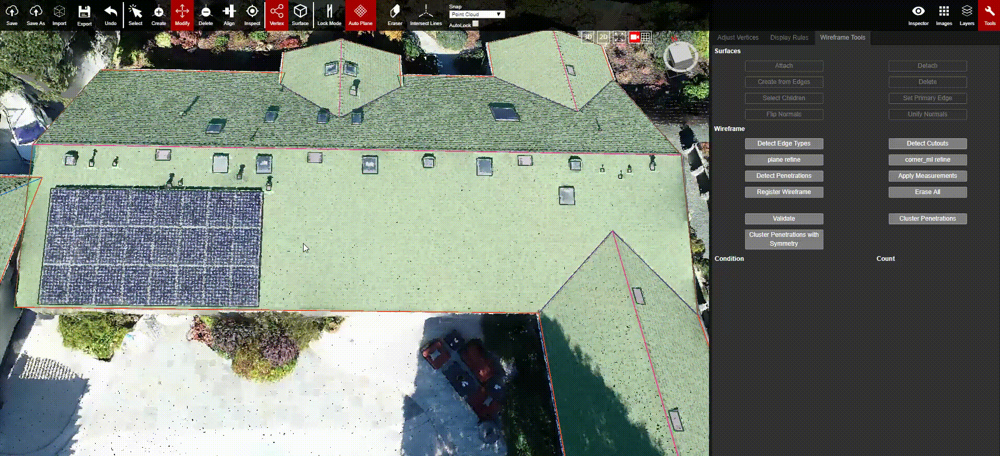

# Select Children

Select Children is fast way to select all of the penetrations/child planes within a plane. This feature can be used to check if all created penetrations are attached, and to select all children planes for quick modifications such as: moving or rotating them all at once, copying/pasting them elsewhere in the wireframe, or adding labels/annotations to them.


⌨ Hotkey : Ctrl + Q -- Select the parent plane, then hit Ctrl + Q and all children will be selected


#### Select Children Example:

