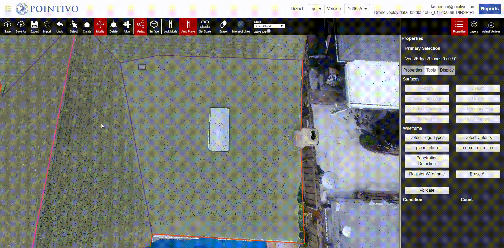

# Select Children

When you select a big plane that contains several attached cutouts, the Select Children button is going to help you select all of the children within that plane. This will allow you to edit them all in unison.


⌨ Shortcut - Ctrl + Q


The video shows the manual way to select the children of a plane. To speed this process up, you can select a plane and then use the shortcut of Ctrl + Q to automatically select all of the children without clicking the Select Children button.

