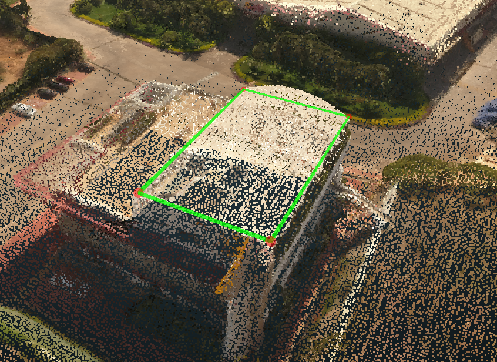

# Create from Edges

1. [Select](../../../basic-function/select.md), or hold `Ctrl` and click to multi-select, all of the edges that should have formed a plane but were not detected as a plane for some reason.

2. Click Create from Edges, and the new plane will be created. [Auto Plane](../../../advanced-function/auto-plane.md) will also turn off since it was on by default. This step should be performed at the end of creating a wireframe. Since Auto Plane will be turned off, any new planes created in the wireframe after this step will not be automatically detected.


Keep in mind that this tool should only be used at the end of wireframe creation, because Auto Plane will be turned off. If Auto Plane is turned back on, after using Create from Edges, the new manually created planes will no longer be detected as planes and this process will have to be repeated.


