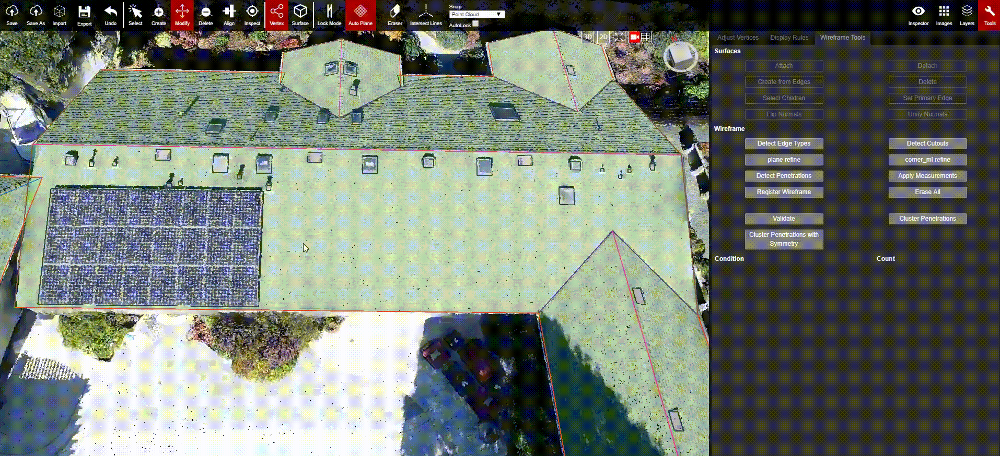

# Select Children

When a big plane is selected, that contains several attached cutouts, the Select Children button is going to help select all of the child planes within that parent plane. This allows the child planes to all be edited at the same time.


⌨ Hotkey - Ctrl + Q


The video shows the manual way to select the children of a plane. To speed this process up, users can select a plane and then use the shortcut of Ctrl + Q to automatically select all of the children without clicking the Select Children button.

