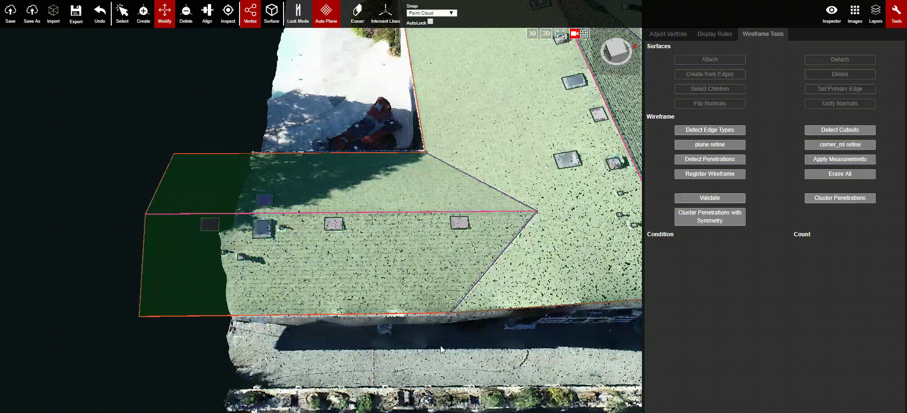

# Set Primary Edge

Every plane has a Primary Edge that is automatically detected. This edge will be the one that is the most parallel to the ground, it won't necessarily be the largest edge. Any attached penetrations, specifically drawn by the Alt + Ctrl shortcut, are going to be aligned with this defaulted primary edge.

However, in some specific cases, the primary edge might be incorrect or the penetrations may need to align with a different edge in the given plane. In those scenarios, the primary edge can be set manually by using the Set Primary Edge button.

1. While in [Surface Mode](), select the Plane that contains the desired Primary Edge.
2. Click Set Primary Edge.
3. Select the Edge is going to be set as the primary \(it's not necessary to switch to [Vertex mode]() here\).
4. The selected edge is now set as the Primary Edge for this Plane.

After selecting and setting the new primary edge, users will need to go back to vertex mode to create a penetration aligned with the new primary edge.

